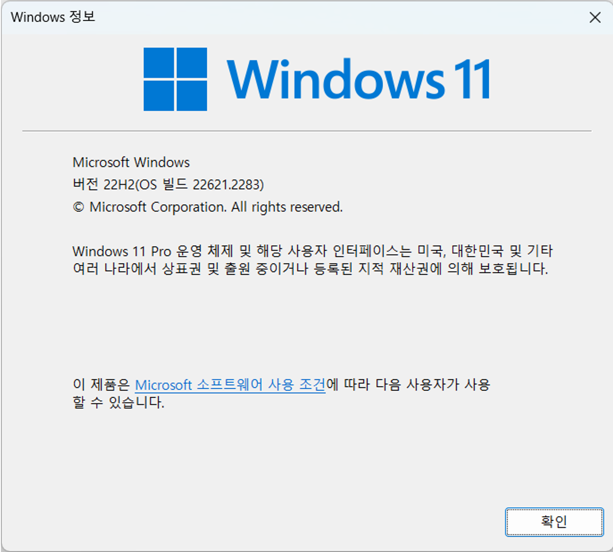

= Windows 11에서 Java 개발환경 설치

== 사전 환경 확인

Windows 운영체제에서 Windows 패키지 관리자, Windows 터미널 등을 사용하기 위해서는 Windows 11 22H2 이상의 버전이 설치되어 있어야 합니다. Windows의 현재 버전은 아래 명령으로 확인할 수 있습니다.

[source, powershell]
----
> winver
----

== Java 설치

Windows Terminal에서, 아래 명령을 실행하여 Eclipse Adoptium의 Open JDK를 설치합니다.

[source, powershell]
----
> winget install -e EclipseAdoptium.Temurin.11.JDK

찾음 Eclipse Temurin JDK with Hotspot 11 [EclipseAdoptium.Temurin.11.JDK] 버전 11.0.20.101
이 응용 프로그램의 라이선스는 그 소유자가 사용자에게 부여했습니다.
Microsoft는 타사 패키지에 대한 책임을 지지 않고 라이선스를 부여하지도 않습니다.
다운로드 중 https://github.com/adoptium/temurin11-binaries/releases/download/jdk-11.0.20.1+1/OpenJDK11U-jdk_x64_windows_hotspot_11.0.20.1_1.msi
  ██████████████████████████████   166 MB /  166 MB
설치 관리자 해시를 확인했습니다.
패키지 설치를 시작하는 중...
설치 성공
----

== Visual Studio Code 설치

Windows Terminal에서, 아래 명령을 실행하여 Visual Studio Code를 설치합니다.

[source, powershell]
----
> winget install -e Microsoft.VisualStudioCode

찾음 Microsoft Visual Studio Code [Microsoft.VisualStudioCode] 버전 1.82.2
이 응용 프로그램의 라이선스는 그 소유자가 사용자에게 부여했습니다.
Microsoft는 타사 패키지에 대한 책임을 지지 않고 라이선스를 부여하지도 않습니다.
다운로드 중 https://az764295.vo.msecnd.net/stable/abd2f3db4bdb28f9e95536dfa84d8479f1eb312d/VSCodeUserSetup-x64-1.82.2.exe
  ██████████████████████████████  89.9 MB / 89.9 MB
설치 관리자 해시를 확인했습니다.
패키지 설치를 시작하는 중...
설치 성공
----

== Git 설치

Windows Terminal에서, 아래 명령을 실행하여 Git을 설치합니다.

[source, powershell]
----
> winget install -e Git.Git

찾음 Git [Git.Git] 버전 2.42.0.2
이 응용 프로그램의 라이선스는 그 소유자가 사용자에게 부여했습니다.
Microsoft는 타사 패키지에 대한 책임을 지지 않고 라이선스를 부여하지도 않습니다.
다운로드 중 https://github.com/git-for-windows/git/releases/download/v2.42.0.windows.2/Git-2.42.0.2-64-bit.exe
  ██████████████████████████████  58.4 MB / 58.4 MB
설치 관리자 해시를 확인했습니다.
패키지 설치를 시작하는 중...
설치 관리자가 관리자 권한으로 실행을 요청합니다. 프롬프트가 필요합니다.
설치 성공
----

