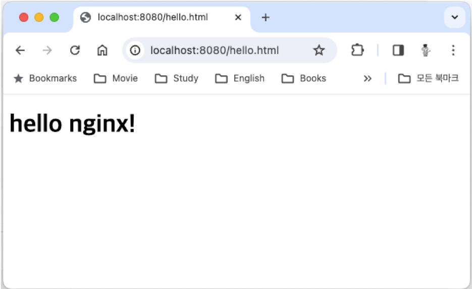

= macOS 11에 Nginx 설치

이 연습에서는 macOS 운영체제에 Nginx 웹 서버를 설치합니다. 아래 절차에 따릅니다.

1. 터미널을 실행합니다.
2. 아래 명령을 실행하여 homebrew를 업데이트 합니다.
+
----
% brew update
----
+
3. 아래 명령을 실행하여 homebrew에서 Nginx 검색합니다.
+
----
% brew search nginx
==> Formulae
nginx
----
+
4. 아래 명령을 실행하여 Nginx 설치합니다.
+
----
% brew install nginx
----
+
5. 설치가 완료되면, 아래 명령을 실행하여 Nginx 시작합니다.
+
----
% brew services start nginx
==> Successfully started `nginx` (label: homebrew.mxcl.nginx)
----
+
6. 아래 명령을 실행하여 실행중인 Nginx 웹 서버에 접속합니다.
+
----
% curl localhost:8080
<!DOCTYPE html>
<html>
<head>
<title>Welcome to nginx!</title>

</head>
<body>
<h1>Welcome to nginx!</h1>

If you see this page, the nginx web server is successfully installed and
working. Further configuration is required.

For online documentation and support please refer to
<a href="http://nginx.org/">nginx.org</a>. 
Commercial support is available at
<a href="http://nginx.com/">nginx.com</a>.

<em>Thank you for using nginx.</em>

</body>
</html>
----
+
7. 웹 브라우저를 실행하고, 주소창에 localhost:8080을 입력하고 이동하여 실행중인 Nginx를 확인합니다.
+ 
image:../images/image11.png[width=600]
+
8. 아래 명령을 실행하여 Nginx 패키지의 설치 정보를 확인합니다.
+
----
% brew info nginx
==> nginx: stable 1.25.3 (bottled), HEAD
HTTP(S) server and reverse proxy, and IMAP/POP3 proxy server
https://nginx.org/
/opt/homebrew/Cellar/nginx/1.25.3 (26 files, 2.4MB) *
  Poured from bottle using the formulae.brew.sh API on 2024-01-31 at 18:24:03
From: https://github.com/Homebrew/homebrew-core/blob/HEAD/Formula/n/nginx.rb
License: BSD-2-Clause
==> Dependencies
Required: openssl@3 ✔, pcre2 ✔
==> Options
--HEAD
	Install HEAD version
==> Caveats
Docroot is: /opt/homebrew/var/www

The default port has been set in /opt/homebrew/etc/nginx/nginx.conf to 8080 so that
nginx can run without sudo.

nginx will load all files in /opt/homebrew/etc/nginx/servers/.

To start nginx now and restart at login:
  brew services start nginx
Or, if you don't want/need a background service you can just run:
  /opt/homebrew/opt/nginx/bin/nginx -g daemon\ off\;
==> Analytics
install: 9,879 (30 days), 31,705 (90 days), 158,756 (365 days)
install-on-request: 9,818 (30 days), 31,589 (90 days), 158,425 (365 days)
build-error: 17 (30 days)
----
+
9. brew의 nginx 패키지 정보에서 Docroot와 nginx.conf 파일 정보를 기억합니다.
10. 아래 명령을 실행하여 Nginx 웹 서버의 Docroot 디렉터리(위에서는 /opt/homebrew/var/www)에 hello.html 파일을 생성합니다.
+
----
% touch /opt/homebrew/var/www/hello.html
----
+
11. 아래 명령을 실행하여 nano 편집기에서 생성한 hello.html 파일을 엽니다.
+
----
% nano /opt/homebrew/var/www/hello.html
----
+
12. nano 편집기에서 hello.html 파일을 아래와 같이 작성한 후, Ctrl + O 키를 누른 후 Enter키를 눌러 저장하고 Ctrl + x 키를 눌러 나노 편집기를 종료합니다.
+
[source, html]
----
<!DOCTYPE html>
<html>
        <body>
                <h1>hello nginx!</h1>
        </body>
</html>
----
13. 웹 브라우저를 실행하고, 주소창에 localhost:8080/hello.html를 입력하고 이동한 후, 페이지를 확인합니다.
+

+
14. 아래 명령을 실행하여 실행중인 Nginx를 중지합니다.
+
----
% brew services stop nginx
Stopping `nginx`... (might take a while)
==> Successfully stopped `nginx` (label: homebrew.mxcl.nginx)
----
