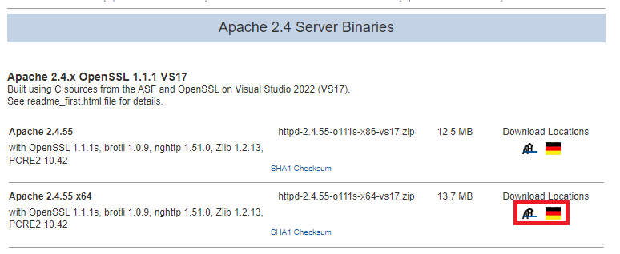
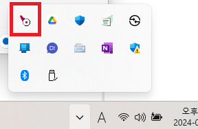
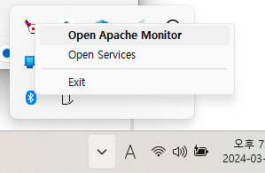
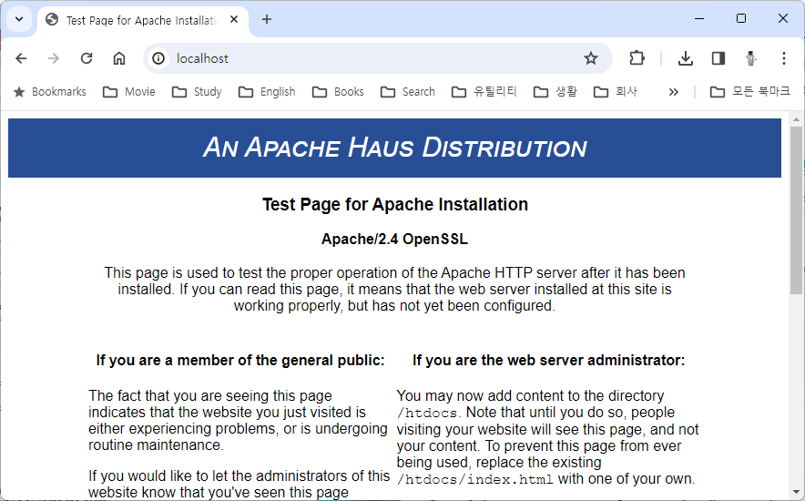

= Windows 11에서 Apache 웹 서버 설치

이 연습에서는 Windows 11 운영체제에 Apache 웹 서버를 설치합니다. 아래 절차에 따릅니다.

1. 웹 브라우저를 실행하고 아래 웹 사이트로 이동합니다.
+
https://dlcdn.apache.org/httpd/binaries/win32/
+
2. 아래 Downloading Apache for Windows 구역에서 ApacheHaus를 클릭합니다.
+
image:../images/image01.png
+
3. Apache Haus 웹 사이트에서 64비트 Binary Apache를 다운로드 합니다.
+

+
4. 다운로드 폴더에서 압축을 해제합니다.
5. 압축이 해제 되면, 압축을 해제한 폴더의 Apache24 폴더를 C 드라이브 루트로 복사합니다.
6. 복사된 폴더(c:\Apache24)의 conf 폴더에서, httpd.conf 파일을 편집기에서 엽니다.
7. Define SRVROOT 항목을 찾아, Apache를 설치한 폴더(c:\Apache24)로 변경합니다.
+
----
Define SRVROOT "c:\Apache24"
ServerRoot "${SRVROOT}"
c:\Apache24\bin 폴더에서 ApacheMonitor.exe를 더블클릭하여 실행합니다.
----
+
8. 윈도우 오른쪽 하단의 시스템 트레이에서 ApacheMonitor가 동작중인것을 확인합니다.
+

+
9. 시스템 트레이에서 ApacheMonitor를 마우스 오른쪽 클릭하고 Open Apache Monitor를 클릭합니다.
+

+
10. Apache Service Monitor가 실행되면 Start 버튼을 클릭하여 Apache 서비스를 시작합니다.
+
image:../images/image05.png[width=550]
+
11. 웹 브라우저를 실행하고 주소창에 http://localhost/ 를 입력하고 이동하여 Apache 웹 서버의 실행을 확인합니다.
+
