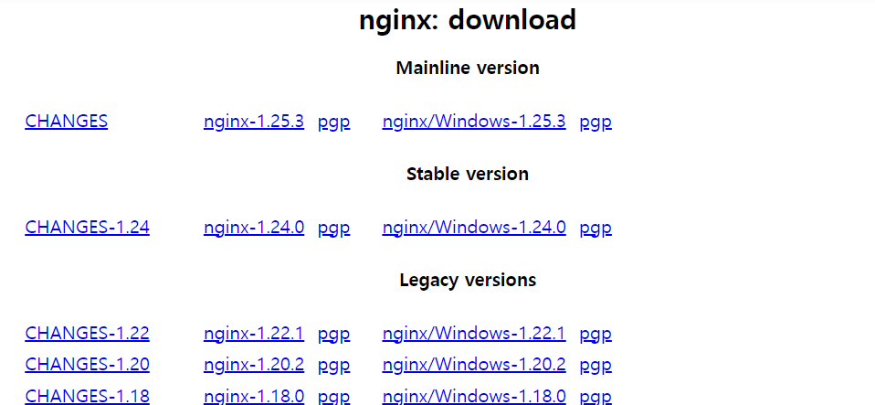
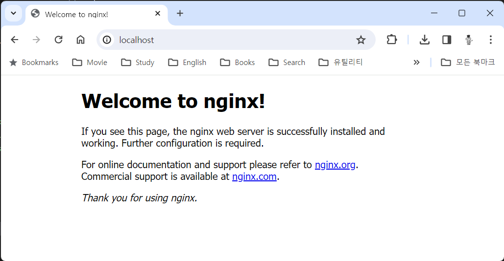

= Windows 11에 Nginx 설치

이 연습에서는 Windows 11 운영체제에 Nginx 웹 서버를 설치합니다. 아래 절차에 따릅니다.

1. 웹 브라우저를 실행하고 Nginx  다운로드 페이지로 이동합니다.
+
https://nginx.org/en/download.html
+
2. Stable version Nginx 다운로드 링크를 클릭하여 다운로드합니다.
+

+
3. 다운로드한 파일을 c:\nginx 폴더에 압축 해제합니다.
4. 명령 프롬프트를 실행합니다.
5. c:\nginx 폴더로 이동하고, 폴더 내의 nginx-<version number> 폴더로 이동합니다.
+
----
c:\> cd nginx\nginx-1.24.0
----
+
6. 아래 명령을 실행하여 Nginx 웹 서버를 시작합니다.
+
----
c:\nginx\nginx-1.24.0> start nginx
----
+
7. 아래 명령을 실행하여 실행중인 Nginx 웹 서버에 접속합니다.
+
----
> curl localhost
<!DOCTYPE html>
<html>
<head>
<title>Welcome to nginx!</title>

</head>
<body>
<h1>Welcome to nginx!</h1>

If you see this page, the nginx web server is successfully installed and
working. Further configuration is required.

For online documentation and support please refer to
<a href="http://nginx.org/">nginx.org</a>. 
Commercial support is available at
<a href="http://nginx.com/">nginx.com</a>.

<em>Thank you for using nginx.</em>

</body>
</html>
----
+
8. 웹 브라우저를 실행하고, 주소창에 localhost를 입력하고 이동하여 실행중인 Nginx를 확인합니다.
+

+
9. 아래 명령을 실행하여 c:\nginx-<version number> 폴더에 hello.html 파일을 생성합니다.
+
----
> fsutil file createnew c:\nginx\nginx-1.24.0\html\hello.html 0
----
+
10. 아래 명령을 실행하여 생성한 hello.html 파일을 메모장에서 엽니다.
+
----
> notepad c:\nginx\nginx-1.24.0\html\hello.html
----
+
11. 메모장에서 hello.html 파일을 아래와 같이 작성하고 저장 후 메모장을 닫습니다.
+
----
<!DOCTYPE html>
<html>
        <body>
                <h1>hello nginx!</h1>
        </body>
</html>
----
+
12. 웹 브라우저를 실행하고, 주소창에 localhost/hello.html를 입력하고 이동한 후, 페이지를 확인합니다.
+

+
13. 아래 명령을 실행하여 Nginx 웹 서버를 종료합니다.
+
----
c:\nginx\nginx-1.24.0> nginx -s quit
----
+
[cols="1a"]
|===
| **참고** Windows에서 Nginx 시작과 종료 명령은 다음과 같습니다.
----
start nginx       // 시작 +
nginx -s stop     // 빠른 종료 +
nginx -s quit     // 일반 종료 +
nginx -s reload   // 리로드
----
|===