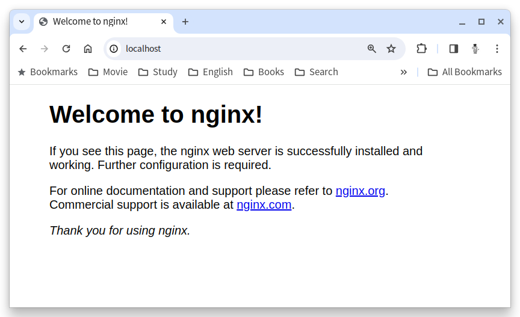

= Linux(Ubuntu) 11에 Nginx 설치

이 연습에서는 Ubuntu 22.04 운영체제에 Nginx 웹 서버를 설치합니다. 아래 절차에 따릅니다.

1. 터미널을 실행합니다.
2. 아래 명령을 실행하여 패키지 저장소를 업데이트합니다.
+
----
$ sudo apt update
----
+
3. 아래 명령을 실행하여 nginx를 설치합니다.
+
----
$ sudo apt install nginx
----
+
4. 아래 명령을 실행하여 Nginx를 시작합니다.
+
----
$ sudo systemctl start nginx
----
+
5. 아래 명령을 실행하여 실행중인 Nginx 웹 서버에 접속합니다.
+
----
% curl localhost
<!DOCTYPE html>
<html>
<head>
<title>Welcome to nginx!</title>

</head>
<body>
<h1>Welcome to nginx!</h1>

If you see this page, the nginx web server is successfully installed and
working. Further configuration is required.

For online documentation and support please refer to
<a href="http://nginx.org/">nginx.org</a>. 
Commercial support is available at
<a href="http://nginx.com/">nginx.com</a>.

<em>Thank you for using nginx.</em>

</body>
</html>
----
+
6. 웹 브라우저를 실행하고, 주소창에 localhost:8080을 입력하고 이동하여 실행중인 Nginx를 확인합니다.
+ 

+
7. 아래 명령을 실행하여 실행중인 Nginx를 중지합니다.
+
----
% brew services stop nginx
Stopping `nginx`... (might take a while)
==> Successfully stopped `nginx` (label: homebrew.mxcl.nginx)
----
+
[cols="1a"]
|===
|**참고** Ubuntu Linux에서 systemctl을 사용하는 Nginx 시작과 종료 명령은 다음과 같습니다. +
----
sudo systemctl start nginx      # 시작 
sudo systemctl stop nginx       # 종료 
sudo systemctl restart nginx    # 재시작 
sudo systemctl reload nginx     # 다시 로드
----

일반 명령은 아래와 같습니다. +
----
$ sudo nginx            # 시작
$ sudo nginx -s stop    # 빠른 종료
$ sudo nginx -s quit    # 정상 종료
$ sudo nginx -s restart # 재시작
$ sudo nginx -s reload  # 다시 로드
----
|===