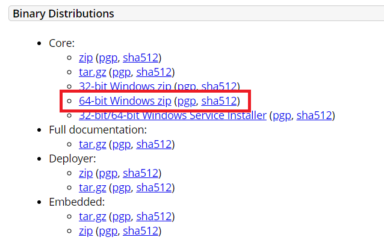
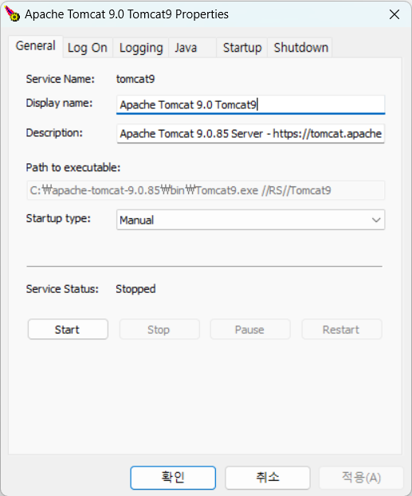
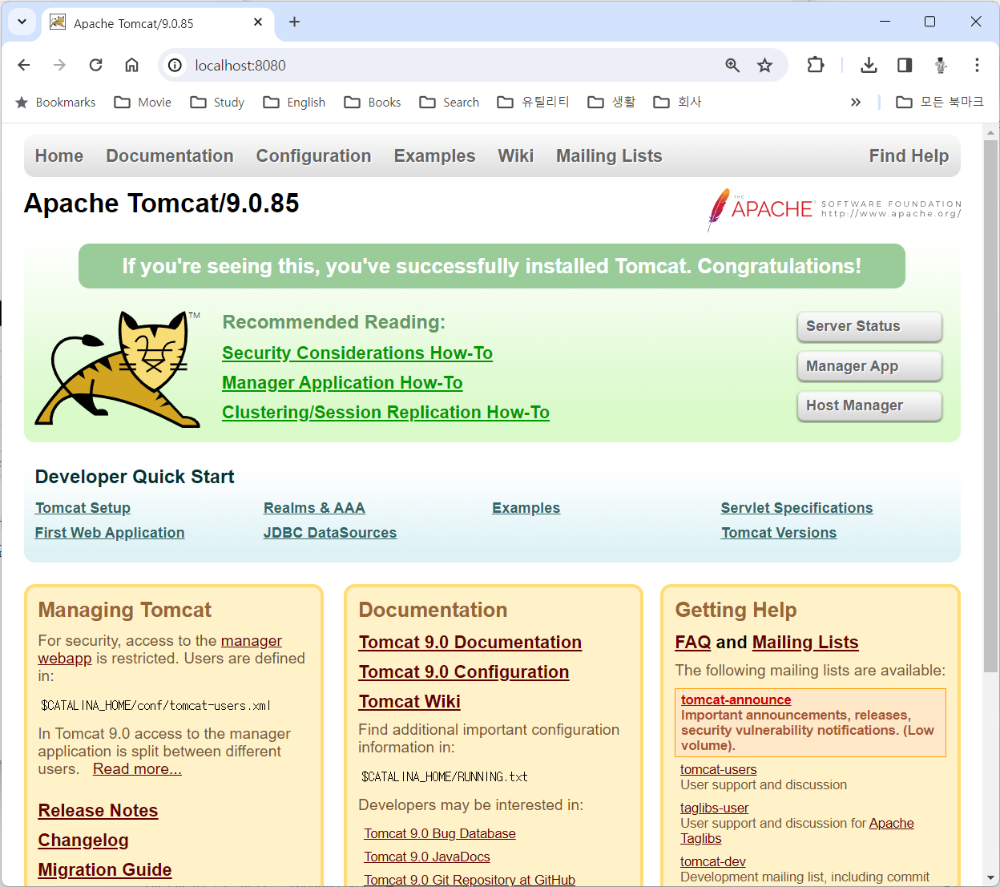
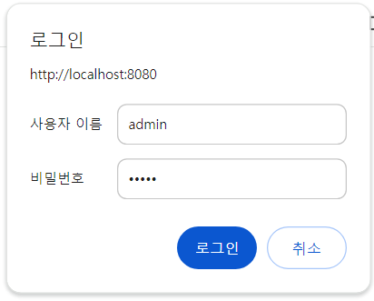
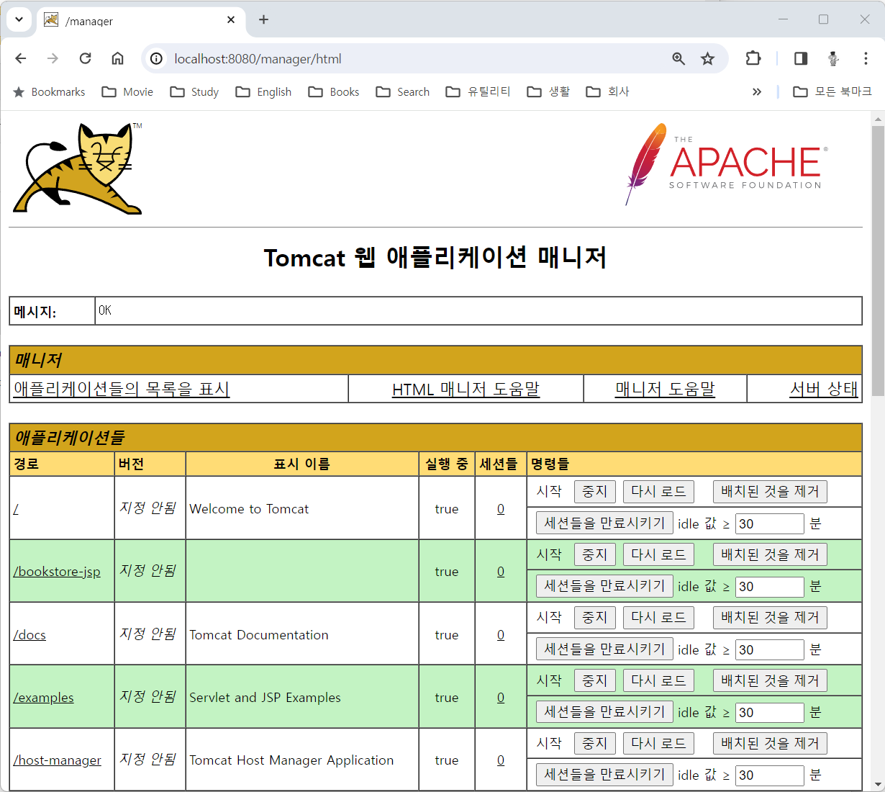

= Windows 11에서 Tomcat 설치

이 연습에서는 Windows 11에서 Tomcat Web Application Server 9 버전을 설치합니다. 아래 절차에 따릅니다.

== 설치된 Java 환경 확인

1. 아래 명령을 실행하여 설치된 Java 버전을 확인합니다.
+
----
> java -version
----
+
|===
| **중요** Java 버전이 표시되지 않는다면, tomcat 설치의 사전 단계로 JDK를 반드시 설치해야 합니다. 아래 link의 문서를 참조하여 설치할 수 있습니다. +
link:./../../01_JDK/01_install_jdk_on_windows_11.adoc[Windows 11에서 Java 개발환경 설치]
|===
+
2. 아래 명령을 실행하여 설치된 Java 컴파일러의 버전을 확인합니다.
+
----
> javac -version
----
+
|===
| **중요** Java 버전이 표시되지 않는다면, tomcat 설치의 사전 단계로 JDK를 반드시 설치해야 합니다. 아래 link의 문서를 참조하여 설치할 수 있습니다. +
link:./../../01_JDK/01_install_jdk_on_windows_11.adoc[Windows 11에서 Java 개발환경 설치]
|===
+
3. 아래 명령을 실행하여 JAVA_HOME 환경 변수를 확인합니다.
+
----
> echo %JAVA_HOME%
----

== Tomcat 설치

1. 웹 브라우저를 열고 아래 웹 사이트로 이동합니다.
+
https://tomcat.apache.org/download-90.cgi
+
2. Binary Distribution 구역에서 64-bit Windows zip을 클릭하여 다운로드합니다.
+

+
3. 다운로드 한 파일을 압축해제 합니다.
4. 압축 해제한 폴더의 , apache-tomcat-9.8.xx 폴더를 c:\ 로 복사합니다.
5. c:\apache-tomcat-9.8.xx\bin 폴더를 열고, tomcat9w.exe 파일을 실행합니다.
6. Apache Tomcat 9.0 Tomcat9 Properties 실행 창에서, General 탭에서 Start 버튼을 클릭합니다.
+

+
7. 서비스가 시작되면, 웹 브라우저를 실행하여 http://localhost:8080 으로 이동하여 실행된 tomcat WAS를 확인합니다.
+

== Tomcat 관리자 계정 설정

1. c:\apache-tomcat-9.8.xx\conf 폴더를 열고, tomcat-users.xml 파일을 편집기에서 엽니다.
2. tomcat-users.xml 파일의 <tomcat-users> 요소의 하위 요소로 아래 두 요소를 추가합니다.
+
[source, xml]
----
<user username="admin" password="admin" roles="manager-gui"/>
<user username="robot" password="admin" roles="manager-script"/>
----
+
3. 파일을 저장합니다.
4. Apache Tomcat 9.0 Tomcat9 Properties 실행 창에서, stop 버튼을 클릭하여 tomcat을 중지한 뒤, Start 버튼을 클릭하여 재시작합니다.
5. 웹 브라우저를 실행하여 http://localhost:8080 으로 이동하고, Manager App 버튼을 클릭합니다.
6. 로그인 창에서, 사용자 이름과 비밀번호에 admin을 입력하고 로그인합니다.
+

+
7. Tomcat 웹 애플리케이션 매니저를 확인합니다.
+
