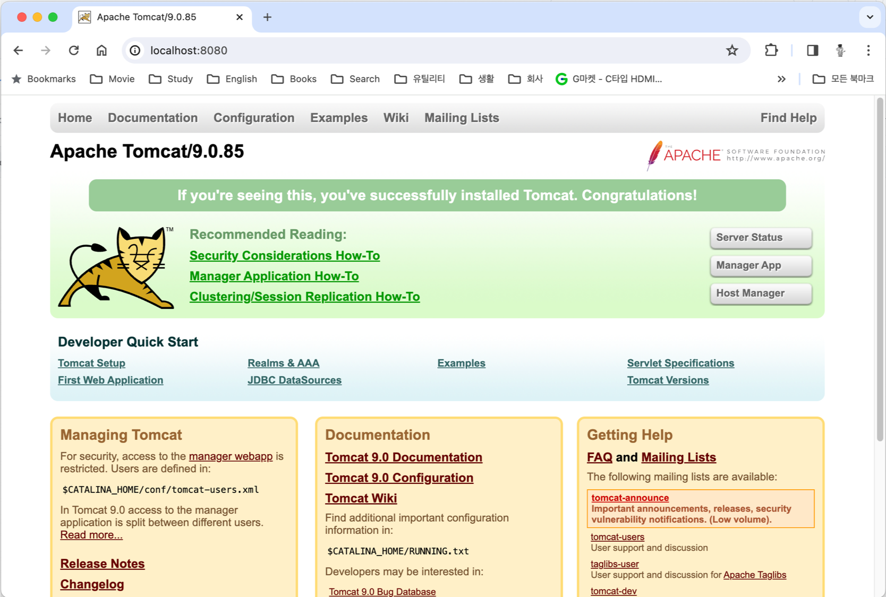
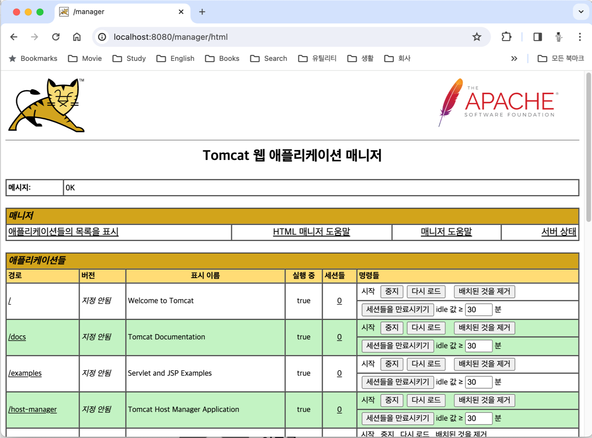

= macOS에서 Tomcat 설치

이 연습에서는 macOS 에서 Tomcat Web Application Server 9 버전을 설치합니다. 아래 절차에 따릅니다.

== 설치된 Java 환경 확인

1. 터미널에서 아래 명령을 실행하여 설치된 Java 버전을 확인합니다.
+
----
% java -version
----
+
|===
| **중요** Java 버전이 표시되지 않는다면, tomcat 설치의 사전 단계로 JDK를 반드시 설치해야 합니다. 아래 link의 문서를 참조하여 설치할 수 있습니다. +
link:./https://github.com/gikpreet/class-environment_settings/blob/main/01_JDK/02_install_jdk_on_macos.adoc[macOS에서 Java 개발환경 설치]
|===
2. 아래 명령을 실행하여 설치된 Java 컴파일러의 버전을 확인합니다.
+
----
% javac -version
----
+
|===
| **중요** Java 버전이 표시되지 않는다면, tomcat 설치의 사전 단계로 JDK를 반드시 설치해야 합니다. 아래 link의 문서를 참조하여 설치할 수 있습니다. +
link:./https://github.com/gikpreet/class-environment_settings/blob/main/01_JDK/02_install_jdk_on_macos.adoc[macOS에서 Java 개발환경 설치]
|===
+
3. 아래 명령을 실행하여 JAVA_HOME 환경 변수를 확인합니다.
+
----
% echo $JAVA_HOME
----

== Tomcat 9 설치

1. **터미널**을 실행합니다.
2. 아래 명령을 실행하여 homebrew를 업데이트 합니다.
+
----
% brew update
----
+
3. 아래 명령을 실행하여 tomcat 9 버전을 설치합니다.
+
----
% brew install tomcat@9
----
+
4. 설치가 완료되면, 아래 명령을 실행하여 tomcat이 설치된 디렉토리로 이동합니다.
+
----
% cd /opt/homebrew/Cellar/tomcat@9/9.0.85/bin
----
+
|===
| **주의** 설치 시기에 따라 tomcat 9의 버전이 다를 수 있습니다. /opt/homebrew/Cellar/tomcat@9 디렉토리 아래의 폴더 이름은 설치된 tomcat 9 버전을 나타냅니다. 설치된 버전에 맞는 디렉토리로 이동합니다. 
|===
+
5. 아래 명령을 실행하여 tomcat을 실행합니다.
+
----
% ./catalina start
----
+
6. 서비스가 시작되면, 웹 브라우저를 실행하여 http://localhost:8080 으로 이동하여 실행된 tomcat WAS를 확인합니다.
+

== Tomcat 관리자 계정 설정

1. /opt/homebrew/Cellar/tomcat@9/9.0.85/libexec/conf 디렉토리로 이동하고, tomcat-users.xml 파일을 편집기에서 엽니다.
2. tomcat-users.xml 파일의 <tomcat-users> 요소의 하위 요소로 아래 두 요소를 추가합니다.
+
[source, xml]
----
<user username="admin" password="admin" roles="manager-gui"/>
<user username="robot" password="admin" roles="manager-script"/>
----
+
3. 파일을 저장합니다.
4. 아래 명령을 실행하여 tomcat이 설치된 디렉토리로 이동합니다.
+
----
% cd /opt/homebrew/Cellar/tomcat@9/9.0.85/bin
----
+
5. 아래 두 명령을 차례대로 실행하여 tomcat을 재시작합니다.
+
----
% ./catalina stop
$ ./catalina start
----
+
6. 웹 브라우저를 실행하여 http://localhost:8080 으로 이동하고, Manager App 버튼을 클릭합니다.
7. 로그인 창에서, 사용자 이름과 비밀번호에 admin을 입력하고 로그인합니다.
+
image:../images/image04.png[width=300]
+
8. Tomcat 웹 애플리케이션 매니저를 확인합니다.
+

