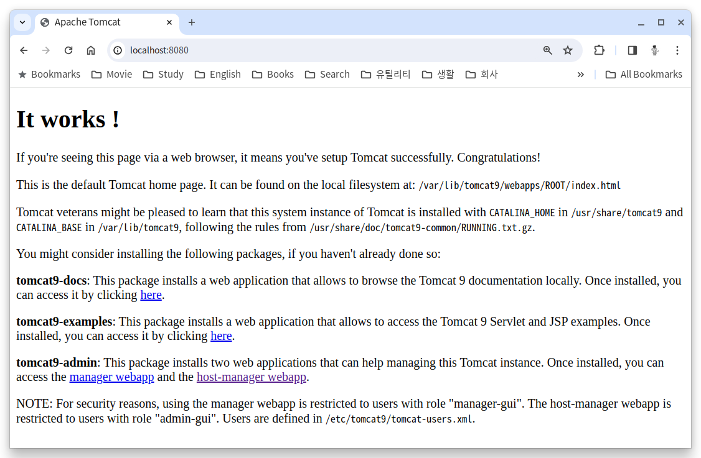
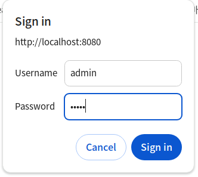
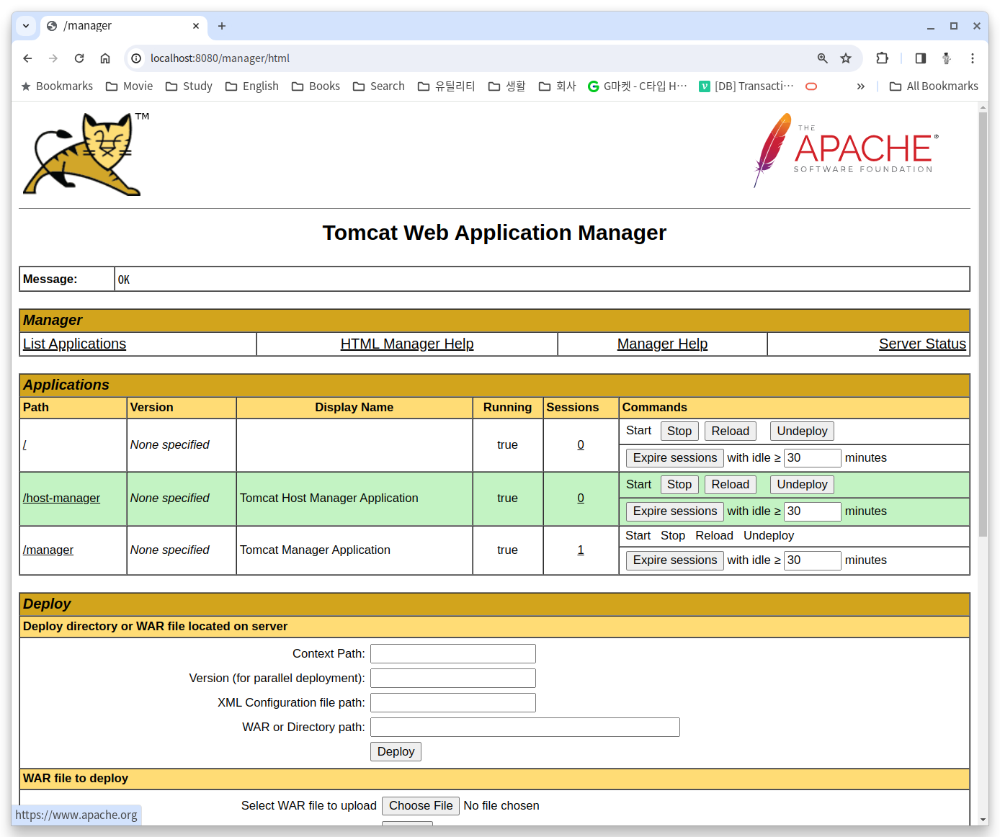

= Linux 에서 Tomcat 설치

이 연습에서는 Ubuntu 22.04 운영체제에 Tomcat Web Application Server 9 버전을 설치합니다. 아래 절차에 따릅니다.

== 설치된 Java 환경 확인

1. 터미널에서 아래 명령을 실행하여 설치된 Java 버전을 확인합니다.
+
----
% java -version
----
+
|===
| **중요** Java 버전이 표시되지 않는다면, tomcat 설치의 사전 단계로 JDK를 반드시 설치해야 합니다. 아래 link의 문서를 참조하여 설치할 수 있습니다. +
link:./https://github.com/gikpreet/class-environment_settings/blob/main/01_JDK/02_install_jdk_on_macos.adoc[macOS에서 Java 개발환경 설치]
|===
2. 아래 명령을 실행하여 설치된 Java 컴파일러의 버전을 확인합니다.
+
----
% javac -version
----
+
|===
| **중요** Java 버전이 표시되지 않는다면, tomcat 설치의 사전 단계로 JDK를 반드시 설치해야 합니다. 아래 link의 문서를 참조하여 설치할 수 있습니다. +
link:./https://github.com/gikpreet/class-environment_settings/blob/main/01_JDK/02_install_jdk_on_macos.adoc[macOS에서 Java 개발환경 설치]
|===
+
3. 아래 명령을 실행하여 JAVA_HOME 환경 변수를 확인합니다.
+
----
% echo $JAVA_HOME
----

== Tomcat 9 설치

1. 터미널에서 아래 명령을 실행하여 패키지를 업데이트 합니다.
+
----
$ sudo apt update
----
+
2. 아래 명령을 실행하여 Tomcat Web Application Server를 설치합니다.
+
----
$ sudo apt install tomcat9
----
+
3. 설치가 완료되면, 아래 명령을 실행하여 Tomcat을 시작합니다.
+
----
$ sudo systemctl start tomcat9
----
+
4. 아래 명령을 실행하여 Tomcat의 상태를 확인합니다.
+
----
$ systemctl status tomcat9
 tomcat9.service - Apache Tomcat 9 Web Application Server
     Loaded: loaded (/lib/systemd/system/tomcat9.service; enabled; vendor preset: enabled)
     Active: active (running) since Mon 2024-03-11 16:54:31 KST; 6s ago
       Docs: https://tomcat.apache.org/tomcat-9.0-doc/index.html
    Process: 148691 ExecStartPre=/usr/libexec/tomcat9/tomcat-update-policy.sh (code=exited, status=0/SUCCESS)
   Main PID: 148695 (java)
      Tasks: 45 (limit: 18615)
     Memory: 152.6M
     CGroup: /system.slice/tomcat9.service
             └─148695 /usr/bin/java -Djava.util.logging.config.file=/var/lib/tomcat9/conf/logging.properties -Djava.util.logging.manager=or>

 3월 11 16:54:32 Rachel tomcat9[148695]:     at org.apache.catalina.webresources.StandardRoot.createMainResourceSet(StandardRoot.java:752)
 3월 11 16:54:32 Rachel tomcat9[148695]:     at org.apache.catalina.webresources.StandardRoot.startInternal(StandardRoot.java:709)
 3월 11 16:54:32 Rachel tomcat9[148695]:     at org.apache.catalina.util.LifecycleBase.start(LifecycleBase.java:183)
 3월 11 16:54:32 Rachel tomcat9[148695]:     ... 41 more
 3월 11 16:54:32 Rachel tomcat9[148695]: Deployment of deployment descriptor [/etc/tomcat9/Catalina/localhost/host-manager.xml] has finishe>
 3월 11 16:54:32 Rachel tomcat9[148695]: Deploying web application directory [/var/lib/tomcat9/webapps/ROOT]
 3월 11 16:54:33 Rachel tomcat9[148695]: At least one JAR was scanned for TLDs yet contained no TLDs. Enable debug logging for this logger >
 3월 11 16:54:33 Rachel tomcat9[148695]: Deployment of web application directory [/var/lib/tomcat9/webapps/ROOT] has finished in [760] ms
 3월 11 16:54:33 Rachel tomcat9[148695]: Starting ProtocolHandler ["http-nio-8080"]
 3월 11 16:54:33 Rachel tomcat9[148695]: Server startup in [848] milliseconds
----
+
5. 만약 아래와 같은 상태가 표시되며 Tomcat이 시작되지 않는 경우, 아래 조치를 취합니다.
+
----
$ systemctl status tomcat9
● tomcat9.service - Apache Tomcat 9 Web Application Server
     Loaded: loaded (/lib/systemd/system/tomcat9.service; enabled; vendor preset: enabled)
     Active: failed (Result: exit-code) since Mon 2024-03-11 15:01:15 KST; 1h 53min ago
       Docs: https://tomcat.apache.org/tomcat-9.0-doc/index.html
   Main PID: 130201 (code=exited, status=1/FAILURE)

 3월 11 15:01:15 Rachel systemd[1]: Starting Apache Tomcat 9 Web Application Server...
 3월 11 15:01:15 Rachel systemd[1]: Started Apache Tomcat 9 Web Application Server.
 3월 11 15:01:15 Rachel tomcat9[130201]: No JDK or JRE found - Please set the JAVA_HOME variable or install the default-jdk package
 3월 11 15:01:15 Rachel systemd[1]: tomcat9.service: Main process exited, code=exited, status=1/FAILURE
 3월 11 15:01:15 Rachel systemd[1]: tomcat9.service: Failed with result 'exit-code'.
----
+
a. /etc/default/tomcat9 파일을 관리자 모드로 엽니다.
+
----
$ sudo /etc/default/tomcat9
----
+
b. 첫 번째 줄에서 아래와 같이 JAVA_HOME을 설정합니다.
+
----
JAVA_HOME=<$JAVA_HOME 환경변수 값>/bin
----
+
c. 아래는 예입니다.
+
----
JAVA_HOME=JAVA_HOME=/usr/lib/jvm/temurin-17-jdk-amd64/bin
----
+
6. 서비스가 시작되면, 웹 브라우저를 실행하여 http://localhost:8080 으로 이동하여 실행된 tomcat WAS를 확인합니다.
+

== Tomcat 9 admin 설치

1. 아래 명령을 실행하여 패키지를 업데이트힙니다.
+
----
$ sudo apt update
----
+
2. 아래 명령을 실행하여 tomcat 관리자를 설치합니다.
+
----
$ sudo apt install tomcat9-admin
----
+
3. 설치가 완료되면, /etc/tomcat9/tomcat-users.xml 파일을 슈퍼유저 권한으로 엽니다.
4. tomcat-users.xml 파일의 <tomcat-users> 요소의 하위 요소로 아래 두 요소를 추가합니다.
+
[source, xml]
----
<role rolename="manager-gui" />
<role rolename="admin-gui" />
<user username="admin" password="admin" roles="manager-gui, admin-gui"/>
<user username="robot" password="admin" roles="manager-script"/>
----
+
5. 파일을 저장합니다.
6. 아래 명령을 실행하여 Tomcat을 재시작합니다.
+
----
$ sudo systemctl restart tomcat9
----
+
7. 웹 브라우저를 실행하여 http://localhost:8080/manager/html 으로 이동합니다.
8. 로그인 창에서, 사용자 이름과 비밀번호에 admin을 입력하고 로그인합니다.
+

+
9. Tomcat 웹 애플리케이션 매니저를 확인합니다.
+

+
10. 아래 디렉토리에서 tomcat에 배포된 응용 프로그램을 확인합니다.
+
----
$ ls /var/lib/tomcat9/webapps
----