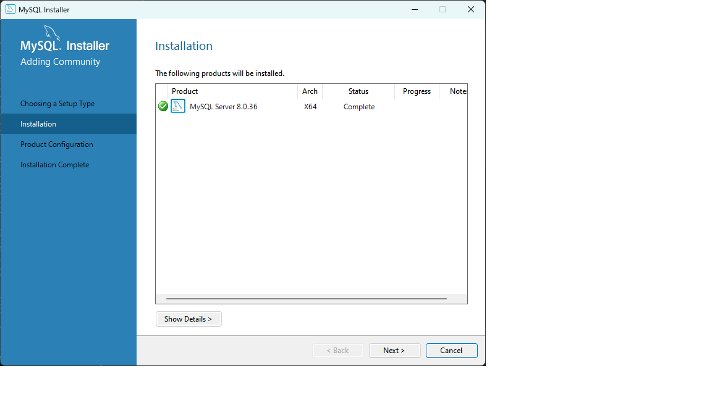
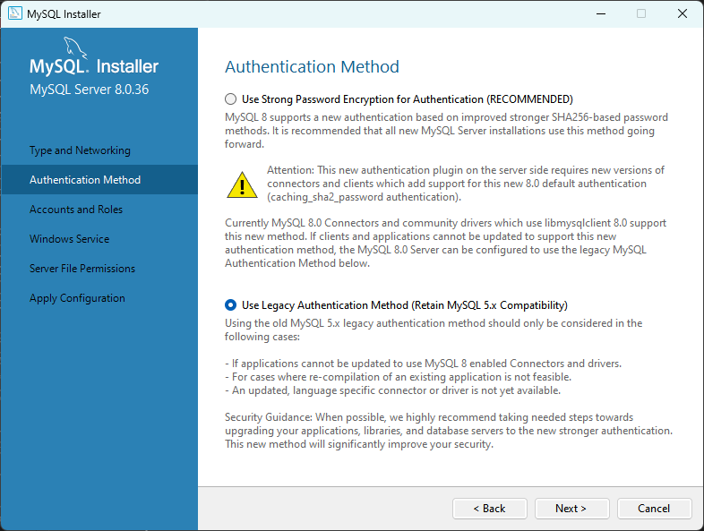

= Windows 11에서 mysql 설치

이 연습에서는 Windows 11 운영체제에 MySQL을 설치합니다. 아래 절차에 따릅니다.

== 사전 환경 확인

Windows 운영체제에서 Windows 패키지 관리자, Windows 터미널 등을 사용하기 위해서는 Windows 11 22H2 이상의 버전이 설치되어 있어야 합니다. Windows의 현재 버전은 아래 명령으로 확인할 수 있습니다.

[source, powershell]
----
> winver
----
+
image:../images/image01.png[width=450]

== MySQL Server 설치

이 연습에서는 Windows 11에서 winget을 사용하여 MySQL을 설치합니다. 아래 절차에 따릅니다.

1. 터미널(또는 명령 프롬프트)를 실행합니다.
2. 아래 명령을 실행하여 MySQL 패키지를 검색합니다.
+
----
> winget search mysql
이름                                장치 ID                            버전          일치       원본
-------------------------------------------------------------------------------------------------------
MySQL Client Go                     9PMCW63W4G3B                       Unknown                  msstore
SQLPro for MySQL                    9PFHQWV7FCHK                       Unknown                  msstore
计算机二级 MySQL 数据库程序设计        9NRBZTD0W1PF                       Unknown                  msstore
计算机二级MySQL拿证直通车——进取培优     9NBNVN4RHD2L                       Unknown                  msstore
MySQL                               Oracle.MySQL                       8.0.36                   winget
SQL Schema Compare                  TiCodeX.SQLSchemaCompare           2023.4.1      Tag: mysql winget
TeamIDE                             TeamIDE.TeamIDE                    2.6.18        Tag: mysql winget
Kangaroo                            Taozuhong.Kangaroo                 4.98.1.240301 Tag: mysql winget
TablePlus                           TablePlus.TablePlus                5.2.6         Tag: mysql winget
PremiumSoft Navicat Premium         PremiumSoft.NavicatPremium         16.1.15       Tag: mysql winget
MySQL Notifier                      Oracle.MySQLNotifier               1.1.8         Tag: mysql winget
TriCo                               ngudbhav.TriCo                     3.1.0         Tag: mysql winget
Azure Data Studio - Insiders        Microsoft.AzureDataStudio.Insiders 1.35.0        Tag: mysql winget
Azure Data Studio                   Microsoft.AzureDataStudio          1.48.0        Tag: mysql winget
MariaDB                             MariaDB.Server                     11.3.2.0      Tag: mysql winget
MAMP & MAMP PRO                     MAMP.MAMP                          5.0.5         Tag: mysql winget
Laragon                             LeNgocKhoa.Laragon                 6.0.0         Tag: mysql winget
DataGrip (EAP)                      JetBrains.DataGrip.EAP             241.14024.11  Tag: mysql winget
DataGrip                            JetBrains.DataGrip                 2023.3.4      Tag: mysql winget
DbGate                              JanProchazka.dbgate                5.2.7         Tag: mysql winget
DBeaver Community Edition           dbeaver.dbeaver                    24.0.1        Tag: mysql winget
Bitnami WAMP Stack                  Bitnami.WAMP                       8.1.11-0      Tag: mysql winget
Beekeeper Studio                    beekeeper-studio.beekeeper-studio  4.2.5         Tag: mysql winget
Arctype                             Arctype.Arctype                    0.9.71        Tag: mysql winget
XAMPP 8.2                           ApacheFriends.Xampp.8.2            8.2.12        Tag: mysql winget
XAMPP 8.1                           ApacheFriends.Xampp.8.1            8.1.12-0      Tag: mysql winget
Dbmate                              amacneil.dbmate                    2.13.0        Tag: mysql winget
MySQL Workbench 8.0 CE              Oracle.MySQLWorkbench              8.0.36                   winget
MySQL Shell                         Oracle.MySQLShell                  8.2.0                    winget
----
+
3. 검색된 MySQL 패키지의 장치 ID를 확인하고, 아래 명령을 실행하여 설치합니다.
+
----
> winget install --id Oracle.MySQL -e
----
+
4. 설치가 완료되면, 시작 버튼을 클릭하고 MySQL Installer - Community를 클릭하여 실행합니다.
+

+
5. MySQL Installer가 실행되면, **Chooing a Setup Type** 페이지에서 **Server only**가 선택된 것을 확인하고 **Next** 버튼을 클릭합니다.
+

+
6. Installation 페이지에서 **Execute** 버튼을 클릭합니다.
+

+
7. 실행이 완료되면 **Next** 버튼을 클릭합니다.
+

+
8. **Product Confugration** 페이지에서 **Next** 버튼을 클릭합니다.
+

+
9. **Authentication Method** 페이지에서 기본값을 선택하고 **Use Legacy Authentication Method**를 선택하고 **Next** 버튼을 클릭합니다.
(프로덕션 환경에서는 Use Strong Password Encryption for Authentication을 선택하는 것이 좋습니다)
+

+
10. **Account and Rules** 페이지에서 **MySQL Root Password**에 패스워드를 입력하고, **Repeat Password**에 반복하여 입력한 후 **Next** 버튼을 클릭합니다.
+
image:../images/image08.png[width=600]
+
11. **Windows Service** 페이지에서 기본값을 유지하고 **Next** 버튼을 클릭합니다.
+
image:../images/image09.png[width=600]
+
12. **Server File Permissions** 페이지에서 기본값을 유지하고 **Next** 버튼을 클릭합니다.
+
image:../images/image10.png[width=600]
+
13. **Apply Configuration** 페이지에서 **Execute** 버튼을 클릭합니다.
+
image:../images/image11.png[width=600]
+
14. 설정이 완료되면 **Finish** 버튼을 클릭합니다.
15. **Product Configuration** 페이지에서 **Next** 버튼을 클릭합니다.
+
image:../images/image12.png[width=600]
+
16. **Installation Complete** 페이지에서 **Finish** 버튼을 클릭합니다.
+

== Server 설치 확인

1. Windows + R 키를 클릭합니다.
2. **실행**창에서 SystemPropertiesAdvanced를 입력하고 실행합니다.
+
image:../images/image14.png[width=400]
+
3. **시스템 속성** 창에서 **환경 변수** 버튼을 클릭합니다.
+
image:../images/image15.png[width=500]
+
4. **환경 변수** 창에서 사용자 변수 영역의 **Path**를 더블클릭합니다.
+

+
5. **환경 변수 편집** 창에서 **새로 만들기** 버튼을 클릭하고 아래 경로를 입력합니다.
+
----
C:\Program Files\MySQL\MySQL Server 8.0\bin
----
+

+
6. **환경 변수 편집** 창에서 **확인** 버튼을 클릭합니다.
7. **환경 변수** 창에서 버튼을 클릭합니다.
8. **시스템 속성** 창에서 **확인** 버튼을 클릭합니다.
9. 터미널(또는 명령 프롬프트)를 실행합니다.
10. 아래 명령을 실행하여 mysql 서버에 접속합니다.
+
----
> mysql -u root -p
----
+
11. 설치시 설정한 암호를 입력하고 MySQL 서버에 로그인 합니다.
+
----
> mysql -u root -p
Enter password: ******
Welcome to the MySQL monitor.  Commands end with ; or \g.
Your MySQL connection id is 10
Server version: 8.0.36 MySQL Community Server - GPL

Copyright (c) 2000, 2024, Oracle and/or its affiliates.

Oracle is a registered trademark of Oracle Corporation and/or its
affiliates. Other names may be trademarks of their respective
owners.

Type 'help;' or '\h' for help. Type '\c' to clear the current input statement.

mysql>
----

== MySQL Workbench 설치

이 연습에서는 MySQL GUI 도구인 MySQL Workbench를 설치합니다. 아래 절차에 따릅니다.

1. 1. 터미널(또는 명령 프롬프트)를 실행합니다.
2. 아래 명령을 실행하여 MySQL Workbench 패키지를 검색합니다.
+
----
> winget search --name mysql workbench
이름                   장치 ID               버전    원본
-------------------------------------------------------------
Musician's Workbench   9N1CJ4PF93WH          Unknown msstore
Workbench Pro          9NK8KT4T8TC3          Unknown msstore
INIP Workbench         9P3F9M1GR1T4          Unknown msstore
MySQL Workbench 8.0 CE Oracle.MySQLWorkbench 8.0.36  winget
----
+
3. 아래 명령을 실행하여 MySQL Workbench 패키지를 설치합니다.
+
----
> winget install --id Oracle.MySQLWorkbench -e
----
+
4. 설치가 완료되면, 시작 버튼을 클릭하고 MySQL Installer - Community를 클릭하여 실행합니다.
5. MySQL Workbench가 실행되면, 
+

+
6. MySQL Workbench가 실행되면, **MySQL Connections** 구역에서 **Local Instance MySQL 8.0**을 클릭합니다.
+

+
7. **Connect to MySQL Server** 대화상자에서 root 사용자 password를 입력하고 **OK** 버튼을 클릭합니다.
+

+
8. MySQL Workbench에서, 접속을 확인합니다.
+
