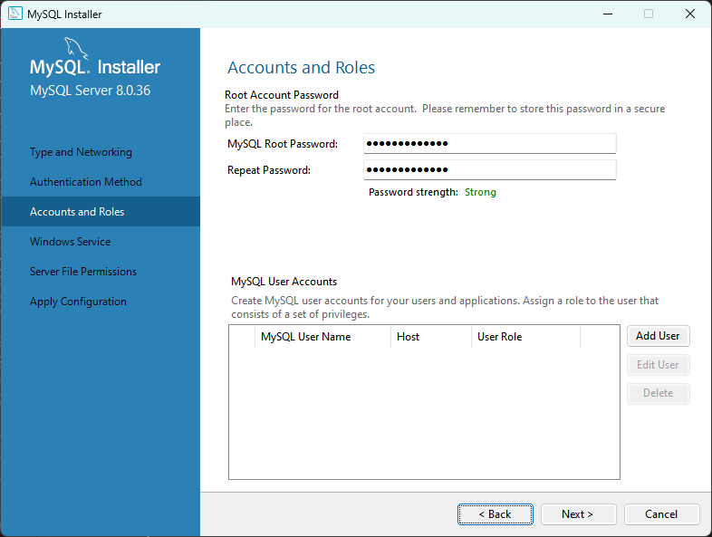
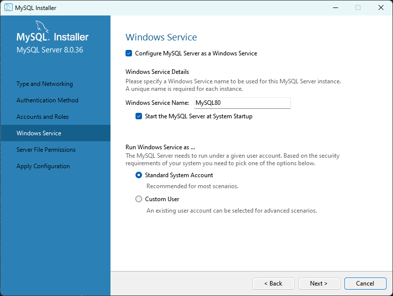
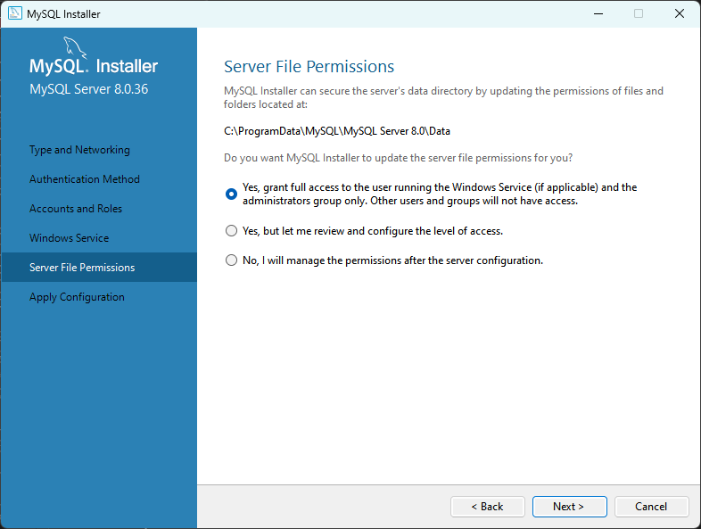
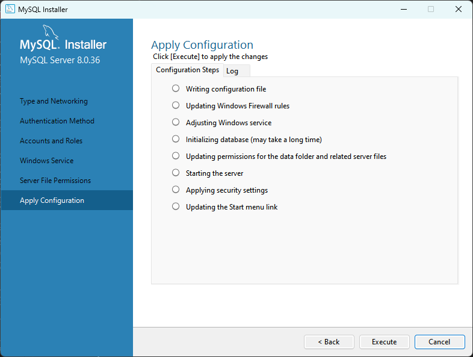
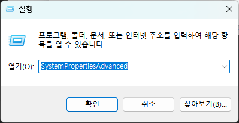
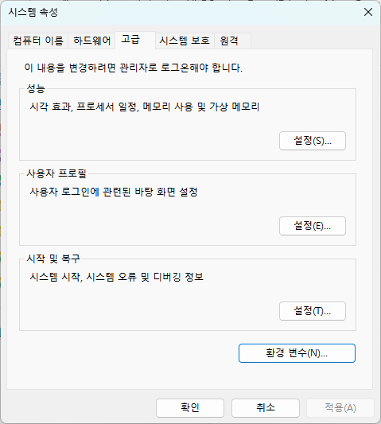

= macOS에서 MySQL 설치

이 연습에서는 macOS sonoma에 mySQL을 설치합니다. 아래 절차에 따릅니다.

== 사전 환경 확인

1. 터미널을 실행합니다.
2. 터미널에서 아래 명령을 실행하여 컴퓨터에 homebrew가 설치되어 있는지 확인합니다.
+
----
% brew -v
----
+

+
3. homerew가 설치되어 있지 않으면, 아래 명령을 실행하여 homebrew를 설치합니다.
+
----
/bin/bash -c "$(curl -fsSL https://raw.githubusercontent.com/Homebrew/install/HEAD/install.sh)"
----

> _**참고** 위 명령이 동작하지 않으면, https://brew.sh/index_ko 에 방문하여 설치 스크립트를 얻어 실행합니다._

== MySQL Server 설치

. homebrew가 설치된 터미널에서 아래 명령을 실행합니다.
+
----
% brew install mysql
----
+

+
. 아래 명령을 실행하여 MySQL을 시작합니다.
+
----
% mysql.server start
----
+
. 아래 명령을 실행하여 기본 설정을 시작합니다.
+
----
% mysql_secure_installation
----
+
명령이 실행되면, MySQL 데이터베이스에 대한 기본 설정과 관련된 응답이 요구됩니다. 순서대로 설정합니다.
+
A. 비밀번호 복잡도 요구사항을 물어봅니다. N을 입력하고 엔터키를 누릅니다.
+

+
B.	root 사용자의 패스워드를 지정합니다.
+

+
C. 익명 사용자를 삭제할 것인지 여부를 물어봅니다. Y를 입력하고 엔터키를 누릅니다.
+
image:../images/image12.png[]
+
D. Root 사용자의 원격 접속을 허용하지 않을 것인지 여부를 물어봅니다. Y를 입력하고 엔터키를 누릅니다.
+
image:../images/image13.png[]
+
E. test 데이터베이스를 삭제할 것인지 물어봅니다. N을 입력하고 엔터키를 누릅니다.
+

+
F. prefilege 테이블을 다시 로드할 것인지 물어봅니다. Y를 입력하고 엔터키를 누릅니다. 설정이 완료됩니다.

+
. 다음 명령을 실행하여 mysql 서비스가 실행중인지 확인합니다.
+
----
% mysql.server status
----