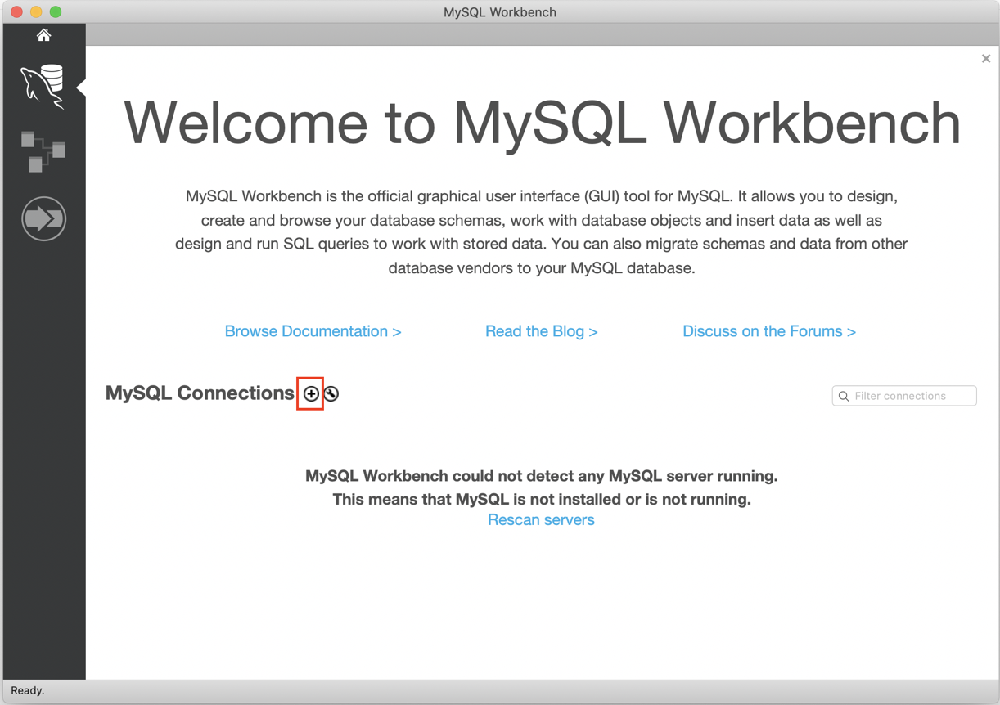
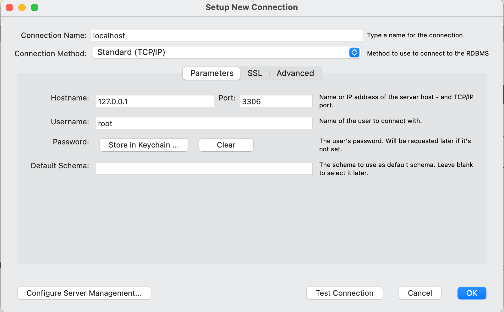
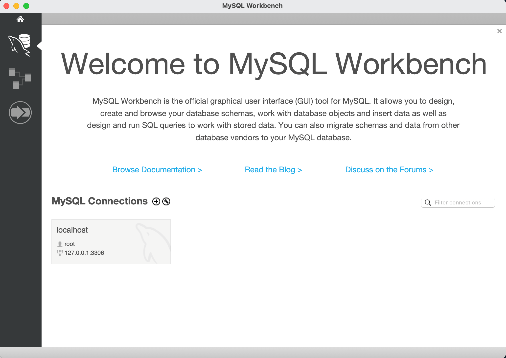
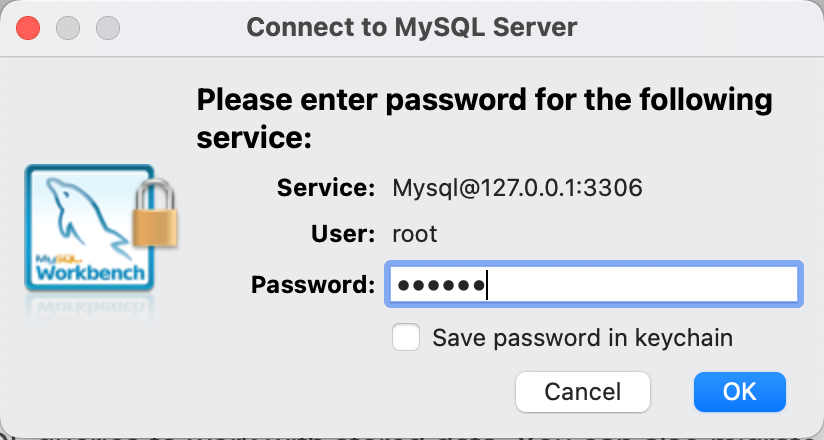
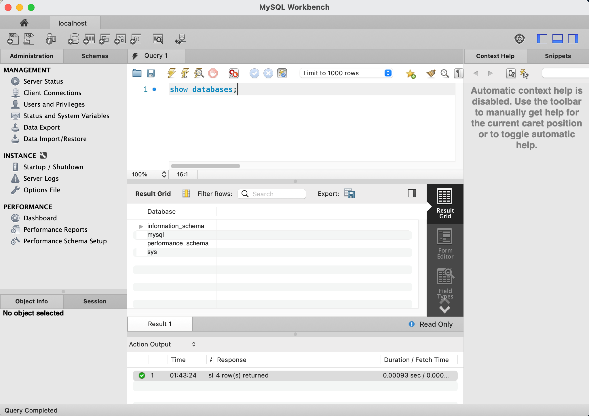

== Docker에서 MySQL 실행

1. 터미널(또는 명령 프롬프트)를 실행합니다.
2. 아래 명령을 실행하여 MySQL 이미지를 다운로드 합니다.
+
----
$ docker pull mysql
----
+
3. 아래 명령을 실행하여 다운로드한 docker 이미지를 확인합니다.
+
----
$ docker images
----
+
4. 아래 명령을 실행하여 MySQL 컨테이너를 실행합니다.
+
----
$ docker run --name mysql82 -e "MYSQL_ROOT_PASSWORD=P@ssw0rd" -p 3306:3306 -d mysql:latest
----
+
5. 아래 명령을 실행하여 컨테이너를 확인합니다.
+
----
$ docker ps 
----
+
6. 아래 명령을 실행하여 컨테이너에 액세스 합니다.
+
----
$ docker exec -it mysql82 mysql -u root -p
Enter password:
Welcome to the MySQL monitor.  Commands end with ; or \g.
Your MySQL connection id is 9
Server version: 8.3.0 MySQL Community Server - GPL

Copyright (c) 2000, 2024, Oracle and/or its affiliates.

Oracle is a registered trademark of Oracle Corporation and/or its
affiliates. Other names may be trademarks of their respective
owners.

Type 'help;' or '\h' for help. Type '\c' to clear the current input statement.

mysql>
----
+
7. 연결된 MySQL에서, 아래 명령을 실행하여 test 데이터베이스를 생성합니다.
+
----
mysql> create database mysqltest;
----
+
8. MySQL Workbench를 실행하고 MySQL Workbench를 실행하고 MySQL Connections 옆의 + 아이콘을 클릭합니다.
+

+
9.	아래와 같이 연결 정보를 입력하고 OK 버튼을 클릭합니다.
A.	Connection Name: `localhost`
B.	Connection Method: `Standard (TCP/IP)`
C.	Hostname: `127.0.0;1`
D.	Port: `3306`
E.	Username: `root`
+

+
10. Welcome 페이지에서 생성된 Connection 패널을 클릭합니다.
+

+
11. Connection to MySQL Server 창에서 패스워드를 입력하고 OK 버튼을 클릭합니다.
+

+
12. 연결을 확인합니다.
+
