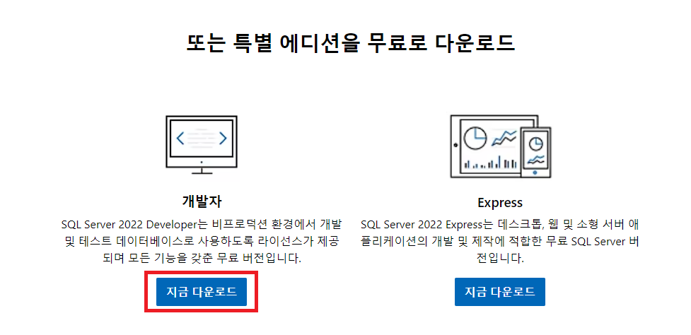
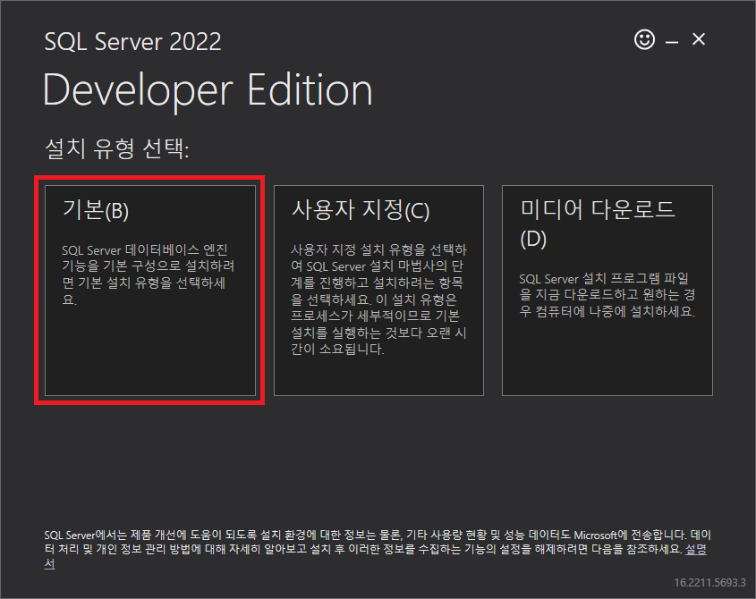
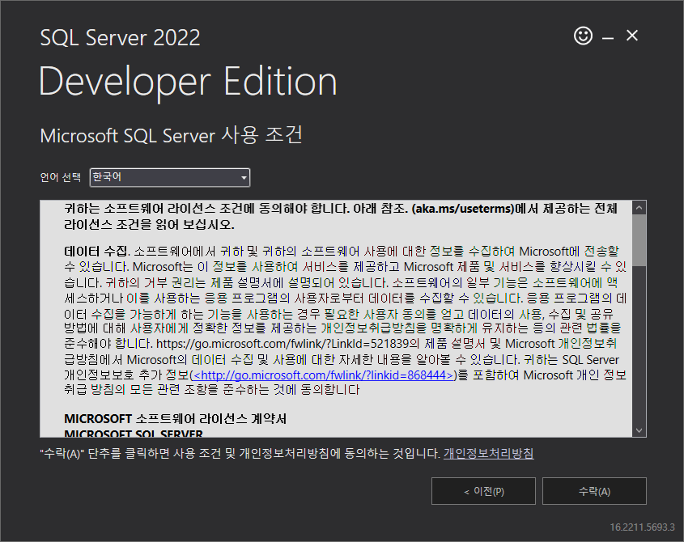
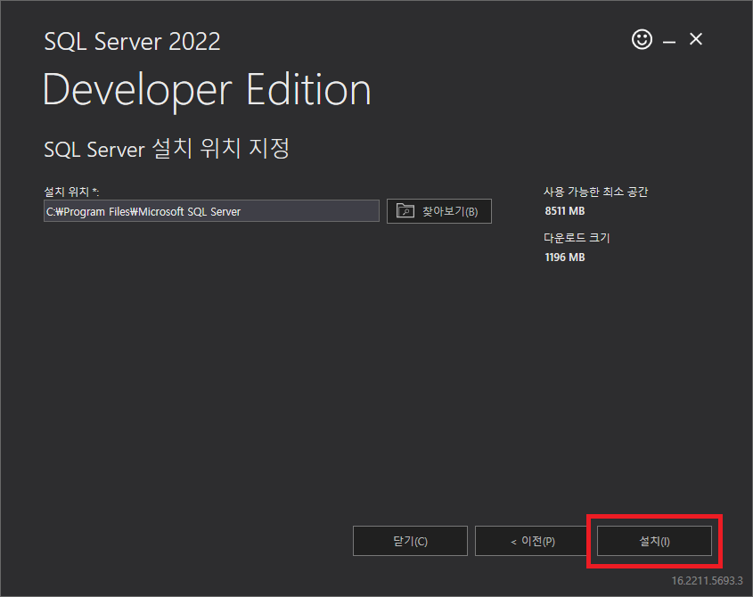
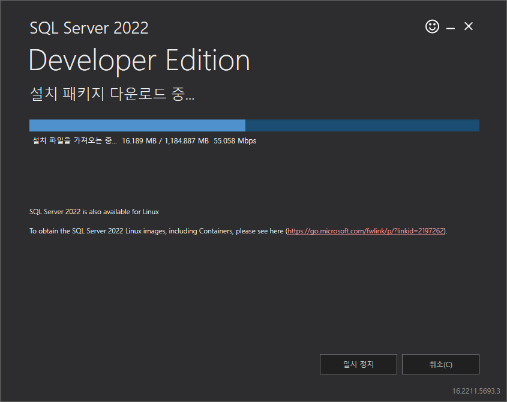

= Windows 11에서 Microsoft SQL Server 설치

이 연습에서는 Windows 11에 Microsoft SQL Server 2022 버전을 설치합니다. 아래 절차에 따릅니다. + 
> 참고: Windows 10에서도 같은 절차로 Microsoft SQL Server 2022를 실행할 수 있습니다.

1. Microsoft SQL Server를 다운로드 하기 위해 웹 브라우저에서 아래 웹 사이트로 이동합니다.
+
link::https://www.microsoft.com/ko-kr/sql-server/sql-server-downloads[SQL Server 다운로드]
+
2. 웹 사이트의 아래쪽에서 *개발자* 구역의 *지금 다운로드* 버튼을 클릭하여 SQL Server를 다운로드합니다.
+

+
3. 다운로드한 파일을 실행하여 설치를 시작합니다.
4. 설치가 시작되면, `설치 유형 선택`에서 `기본`을 클릭합니다.
+

+
5. SQL Server 사용 조건 페이지에서 `수락` 버튼을 클릭합니다.
+

+
6. SQL Server 설치 위치 지정 페이지에서 위치를 확인하고 '설치' 버튼을 클릭합니다.
+

+
7. 설치가 시작됩니다.
+

