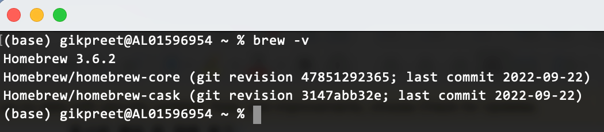

= macOS에서 Azure Data Studio 설치

macOS에서는 Microsoft SQL Server를 설치하고 실행할 수 없습니다. 이 연습에서는 macOS에서 Microsoft SQL Server에 접속할 수 있는 GUI 도구인 Azure Data Studio를 설치합니다. 아래 절차에 따릅니다.

== 사전 환경 확인

1. 터미널을 실행합니다.
2. 터미널에서 아래 명령을 실행하여 컴퓨터에 homebrew가 설치되어 있는지 확인합니다.
+
----
% brew -v
----
+

+
3. homerew가 설치되어 있지 않으면, 아래 명령을 실행하여 homebrew를 설치합니다.
+
----
/bin/bash -c "$(curl -fsSL https://raw.githubusercontent.com/Homebrew/install/HEAD/install.sh)"
----

> _**참고** 위 명령이 동작하지 않으면, https://brew.sh/index_ko 에 방문하여 설치 스크립트를 얻어 실행합니다._

== Azure Data Studio 설치

1. 터미널을 실행합니다.
2. 아래 명령을 실행하여 Azure Data Studio를 설치합니다.
+
----
% brew install --cask azure-data-studio
----