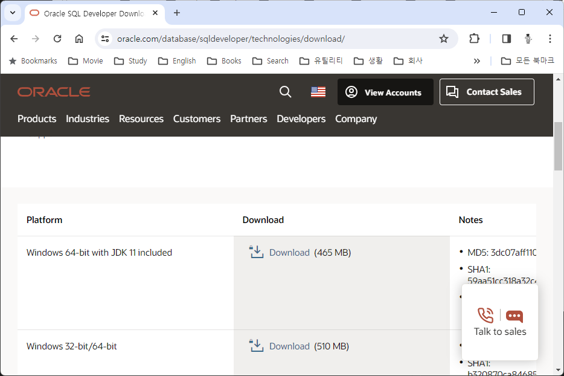
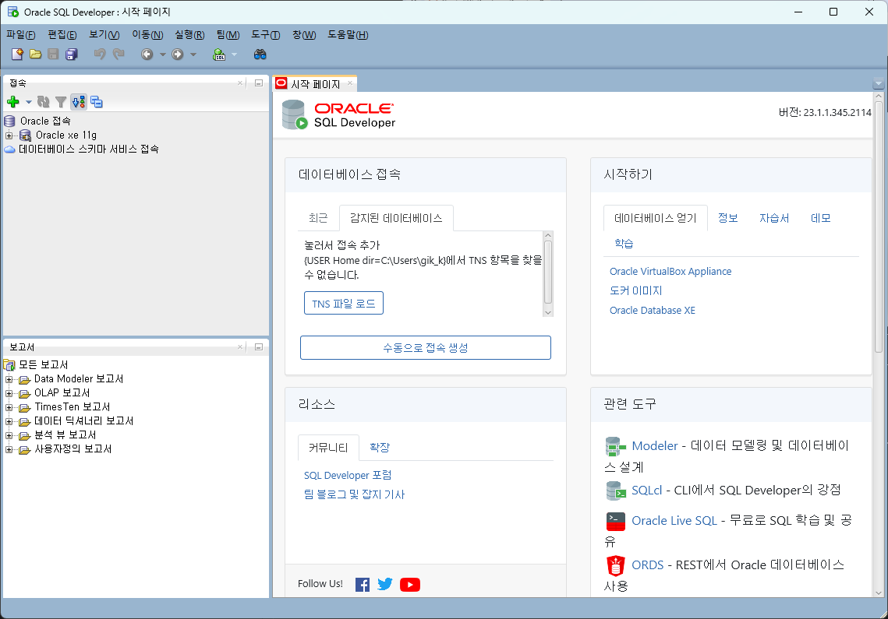
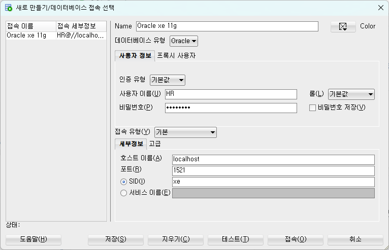
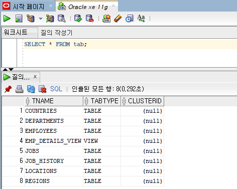

= Windows 11에서 Oracle Developer 설치

1. 웹 브라우저를 실행하고 아래 웹 사이트로 이동합니다.
+
https://www.oracle.com/database/sqldeveloper/technologies/download/
+
2. **Windows 64-bit with JDK 11 included**를 다운로드 합니다.
+

+
|===
|**참고** 다운로드를 위해서는 Oracle 계정이 필요합니다. 필요한 경우 Oracle 계정을 생성합니다.
|===
3. 다운로드가 완료되면, 압축을 해제합니다.
4. 압축이 해제되면, sqldeveloper.exe 파일을 더블클릭하여 실행합니다.
5. SQL Developer가 실행되면, **데이터베이스 접속** 구역에서 **수동으로 접속 생성** 버튼을 클릭합니다.
+

+
6. **새로 만들기/데이터베이스 접속 선택** 창에서 아래와 같이 정보를 입력하고 **접속** 버튼을 클릭합니다.
* **Name** Oracle xe 11g
* **사용자 이름** HR
* **비밀번호** Passw0rd
* **호스트 이름** localhost
* **포트** 1521
* **SID** xe
+

+
7. **질의 작성기**에서 아래 쿼리를 입력하고 실행합니다.
+
[source, sql]
----
SELECT * FROM tab;
----
+
