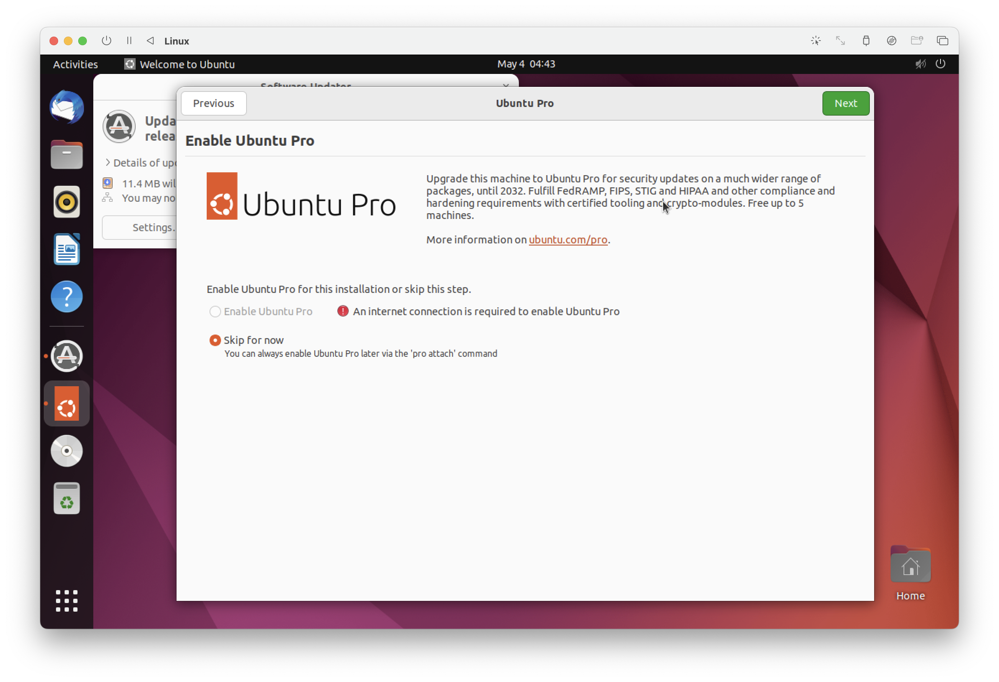

= macOD에 Ubuntu Linux 설치

== UTM(Hypervisor) 설치

UTM은 QEUM 하이퍼바이저를 이용하여 iOS와 macOS에서 x86을 비롯한 여러 환경의 가상화, 에뮬레이션을 가능하게 하는 오픈소스 소프트웨어입니다. Apple Silicon이 탑재된 mac이 출시된 이후로는 macOS용 빌드도 제공됩니다.

1. 웹 브라우저를 열고 아래 링크로 이동합니다.
+
https://mac.getutm.app/
+
2. 다운로드 링크를 클릭하여 UTM.dmg 파일을 다운로드 합니다.
3. UTM을 설치합니다.

== Ubuntu 22.04 Arm64 다운로드

1. 웹 브라우저를 열고 아래 링크로 이동합니다. 
+
https://ubuntu.com/download/server/arm
+
2. Download Ubuntu 22.04 LTS 버튼을 클릭하여 다운로드합니다.

== UTM에 Ubuntu 22.03 Arm64 설치

=== 가상 컴퓨터 생성

1. Launch Pad에서 UTM을 실행하고 `새 가상머신 만들기` 를 클릭합니다.
+

+
2. Start 페이지에서 Visualize 버튼을 클릭합니다.
+

+
3. 운영체제 페이지에서 Linux 버튼을 클릭합니다.
+

+
4. Linux 페이지에서 탐색 버튼을 클릭하고 다운로드한 우분투 ISO 이미지를 선택한 후, Continue 버튼을 클릭합니다.
+

+
5. 장치 페이지에서 설정을 확인하고, Continue 버튼을 클릭합니다.
+

+
6. Storage 페이지에서 설정을 확인하고, Continue 버튼을 클릭합니다.
+

+
7. 공유폴더 페이지에서 Continue 버튼을 클릭합니다.
+

+
8. Summary 페이지에서 가상 컴퓨터 정보를 확인하고 저장 버튼을 클릭합니다.
+

=== Ubuntu 설치 

1. UTM에서, 가상 컴퓨터의 실행 버튼을 클릭합니다.
+

+
2. Try of Install Ubuntu Server를 선택하고 Enter 키를 누릅니다.
+

+
3. English를 선택하고 Enter키를 누릅니다.
+
image:./images/image11.png[width=600]
+
4. 언어 선택을 확인하고 Done을 선택한 후 Enter 키를 누릅니다.
+

+
5. Ubuntu Server를 선택하고 아래쪽에서 Done을 선택한 후 Enter 키를 누릅니다.
+

+
6. 네트워크 선택을 확인하고 아래쪽에서 Done을 선택한 후 Enter 키를 누릅니다.
+

+
7. Proxy Address 설정은 건너뜁니다. 아래쪽에서 Done을 선택한 후 Enter 키를 누릅니다.
+

+
8. Mirror Address 설정에서, 기본값을 유지하고 아래쪽에서 Done을 선택한 후 Enter 키를 누릅니다.
+

+
9. Storage 설정에서 Use an entire disk가 선택된 것을 확인하고 아래쪽에서 Done을 선택한 후 Enter 키를 누릅니다.
+

+
10. System Summary를 확인하고 아래쪽에서 Done을 선택한 후 Enter 키를 누릅니다.
+

+
11. 경고 메시지를 확인하고 Continue를 선택한 후 Enter 키를 누릅니다.
+

+
12. Profile Setup에서 사용자 이름, 서버 이름, 패스워드를 입력하고 Done을 선택한 후 Enter 키를 누릅니다.
+

+
13. Upgrade to Ubuntu Pro에서 Skip for now를 선택하고 아래쪽에서 Continue를 선택한 후 Enter 키를 누릅니다.
+

+
14. SSH Setup에서 Install OpenSSH Server를 선택한 후 아래쪽에서 Done을 선택한 후 Enter 키를 누릅니다.
+

+
15. Featured Server Snaps에서 아무것도 선택하지 않고 아래쪽에서 Done을 선택한 후 Enter 키를 누릅니다.
+

+
16. 설치가 시작됩니다.
+

+
17. 설치가 완료되면, 아래쪽에서 Reboot Now를 선택하고 Enter Key를 누릅니다.
+

+
18. 커서가 오랫동안 깜박이면 창을 닫습니다.
+

+
19. UTM에서 가상 컴퓨터의 시작 버튼을 클릭하여 가상 컴퓨터를 다시 시작합니다.
+

+
20. 가상 컴퓨터에서 Boot from next Button을 선택하고 Enter Key를 누릅니다.
+

+
21. 가상 컴퓨터가 부팅되면, 생성한 ID와 패스워드로 로그인합니다.
+

=== GUI 설치

1. 아래 명령을 실행하여 apt를 업데이트 합니다.
+
----
$ sudo apt update
----
+
2. 패스워드를 입력합니다.
3. 업데이트 되는 것을 확인합니다.
4. 다음 명령을 실행하여 GUI를 설치합니다.
+
----
$ sudo apt install ubuntu-desktop -y
----
+
5. Daemons using outdated libraries에서 tab 키를 눌러 OK로 이동하고 Enter 키를 누릅니다.
+

+
6. 설치가 완료되면 프롬프트에서 아래 명령을 실행하여 시스템을 재 시작합니다. 
+
----
$ sudo reboot
----
+
7. 가상 컴퓨터에서 Boot from next Button을 선택하고 Enter Key를 누릅니다. 
8. GUI 모드로 부팅합니다. 사용자 ID를 클릭합니다.
+

+
9. 패스워드를 입력합니다.
+

+
10. Ubuntu Pro 업데이트 페이지에서, Skip for Now가 선택된 것을 확인하고 오른쪽 위의 Next 버튼을 클릭합니다. 
11. Help improve Ubuntu에서 적당한 옵션을 선택하고 오른쪽 위의 Next 버튼을 클릭합니다. 
12. Privacy 페이지에서 적당한 옵션을 선택하고 Next 버튼을 클릭합니다. 
13. You're ready to go 페이지에서 오른쪽 위의 Done 버튼을 클릭합니다.

=== nettools 설치

1. 왼쪽 아래의 Show Applications 버튼을 클릭합니다.
2. terminal을 클릭하여 실행합니다.
3. 아래 명령을 실행하여 network 도구들을 설치합니다.
+
----
$ sudo apt install net-tools
----

=== SSH Server 설치

1. Terminal에서 아래 명령을 실행하여 SSH Server를 설치합니다.
+
----
$ sudo apt install openssh-server
----

=== Firefox 설치

1. Terminal에서 아래 명령을 실행하여 Firefox를 설치합니다.
+
----
$ sudo apt install firefox
----

=== Visual Studio Code 설치

1. Firefox를 실행합니다.
2. 아래 웹 사이트로 이동합니다. 
+
https://code.visualstudio.com/download
+
3. 가운데 리눅스 구역에서 .deb, x64를 클릭하여 다운로드 합니다. (macOS의 경우 deb, armn64)
+

+
4. Terminal에서, \$HOME/Downloads 디렉토리로 이동합니다. 
+
----
$ cd $HOME/Downloads
----
5. 아래 명령을 실행하여 Visual Studio Code를 설치합니다. 
+
----
$ sudo apt install ./code_1.78.0-xxxxxxx_arm64.deb(다운로드 한 파일 이름)
----