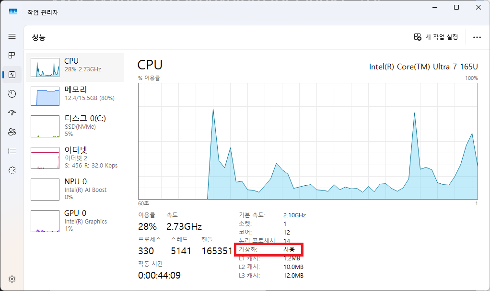
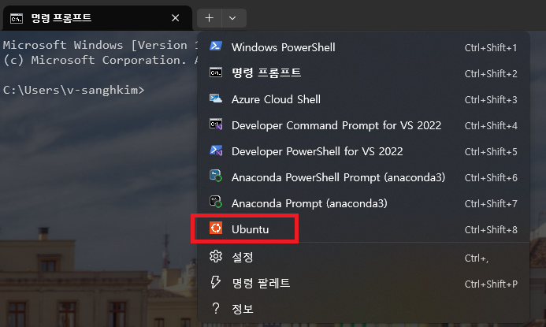

= WSL (Windows Subsystem for Linux) 설치

== 사전 환경 확인

Windows 운영체제에서 Windows 패키지 관리자, Windows 터미널 등을 사용하기 위해서는 Windows 11 22H2 이상의 버전이 설치되어 있어야 합니다. Windows의 현재 버전은 아래 명령으로 확인할 수 있습니다.

[source, powershell]
----
> winver
----

image:./images/image01.png[width=450]

Windows 운영체제에서 WSL을 사용하려면 운영체제가 설치된 하드웨어가 가상화를 지원해야 합니다. 작업 관리자의 **성능** 탭에서 확인할 수 있습니다.

== Windows Subsystem for Linux 설치

1. 명령 프롬프트 또는 터미널을 실행합니다.
2. 아래 명령을 실행하여 wsl 설치를 시작합니다.
+
----
wsl -- install
----
+
3. 시스템을 리부팅 합니다.
4. 리부팅이 완료되면, 터미널을 실행하고 아래 명령을 한번 더 실행하여 ubuntu linux를 설치합니다.
+
----
wsl --install
----
5. Ubuntu의 기본 사용자를 지정합니다.
+
----
Create a default Unix user account:
----
+
6. 터미널을 종료합니다.

== Ubuntu 실행

1. 티미널을 다시 시작합니다.
2. 터미널 위쪽의 + 옆 화살표를 클릭하고 Ubuntu를 클릭합니다.
+

3. Ubuntu 기본 계정 이름을 입력합니다.
+
----
Create a default Unix user account: 
----
4. 계정의 암호를 입력합니다.
+
----
New password:
Retype new password:
passwd: password updated successfully
----
5. Ubuntu Linux가 시작됩니다.
+
----
To run a command as administrator (user "root"), use "sudo <command>".
See "man sudo_root" for details.

Welcome to Ubuntu 24.04.3 LTS (GNU/Linux 6.6.87.2-microsoft-standard-WSL2 x86_64)

 * Documentation:  https://help.ubuntu.com
 * Management:     https://landscape.canonical.com
 * Support:        https://ubuntu.com/pro

 System information as of Thu Sep  4 15:00:40 KST 2025

  System load:  0.15                Processes:             31
  Usage of /:   0.1% of 1006.85GB   Users logged in:       0
  Memory usage: 7%                  IPv4 address for eth0: 192.168.40.211
  Swap usage:   0%

This message is shown once a day. To disable it please create the
/home/gikpreet/.hushlogin file.
gikpreet@ltimindtree:~$
----