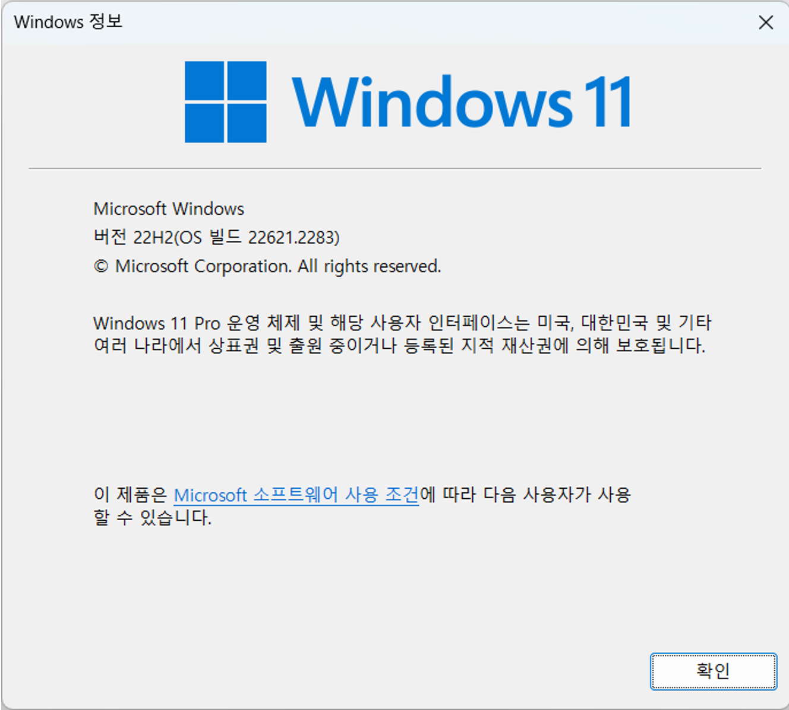

= Windows 11에 Azure CLI 설치

이 문서에서는 Microsoft Windows에 Azure CLI(Command Line Interface)를 설치하는 방법을 설명합니다. 

== 사전 환경 확인

Windows 운영체제에서 Windows 패키지 관리자, Windows 터미널 등을 사용하기 위해서는 Windows 11 22H2 이상의 버전이 설치되어 있어야 합니다. Windows의 현재 버전은 아래 명령으로 확인할 수 있습니다.

[source, powershell]
----
> winver
----

== Windows 패키지 관리자를 사용하여 설치

Windows용 패키지 관리자인 WinGet을 사용하여 Azure CLI를 설치할 수 있습니다. 기본적으로 winget은 64비트 운영체제에 64비트 CLI를 설치합니다. 아래 절차에 따릅니다.

1. Terminal 또는 명령 프롬프트를 실행합니다.
2. 아래 명령을 실행하여 Azure CLI의 설치 여부를 확인합니다.
+
----
winget list | findstr AzureCLI
----
+
3. 설치되어 있지 않다면(결과가 표시되지 않으면) 아래 명령을 실행하여 Windows 패키지 관리자에서 Azure CLI를 검색합니다.
+
----
winget search AzureCLI
----
4. 검색 결과는 아래와 유사할 것입니다.
+
----
이름                장치 ID            버전   원본
-----------------------------------------------------
Microsoft Azure CLI Microsoft.AzureCLI 2.77.0 winget
----
+
5. 아래 명령을 실행하여 Azure CLI를 설치합니다.
+
----
winget install --id Microsoft.AzureCLI
----
[cols="1a"]
+
|===
| **참고** 아래와 같이 --version 옵션을 사용하여 설치를 원하는 버전을 지정할 수 있습니다. 
----
winget install --exact --id Microsoft.AzureCLI --version 2.67.0
----
`--exact` 옵션은 패키지가 설치되어 있는지 여부를 확인합니다.
|===
+
6. 설치가 완료되면, 터미널(또는 명령 프롬프트)를 종료합니다.
7. 터미널(또는 명령 프롬프트)를 다시 시작합니다.
8. 아래 명령을 실행하여 설치된 Azure CLI 버전을 확인합니다.
+
----
az version
----
+
9. 결과는 아래와 유사할 것입니다.
+
----
{
  "azure-cli": "2.77.0",
  "azure-cli-core": "2.77.0",
  "azure-cli-telemetry": "1.1.0",
  "extensions": {}
}
----

== msi를 사용해서 실행

Windows 패키지 관리자를 사용하기 어려운 환경인 경우, msi를 다운로드 하여 설치할 수 있습니다.

1. 아래 웹 사이트로 이동하여 사용중인 컴퓨터의 아키텍처에 맞는 msi 를 다운로드 합니다.
+
https://aka.ms/installazurecliwindows[32bit Azure CLI 다운로드] +
https://aka.ms/installazurecliwindowsx64[64bit Azure CLI 다운로드]
+
2. 다운로드 한 msi를 더블클릭하여 설치합니다.