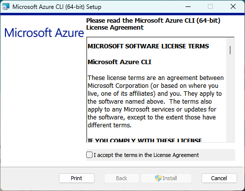
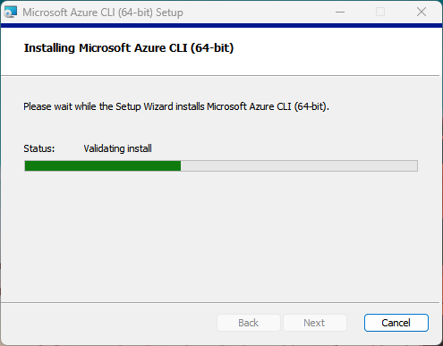
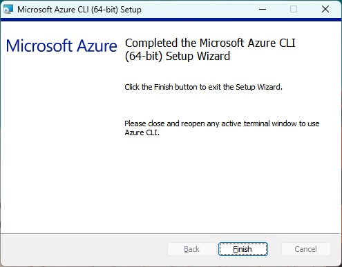
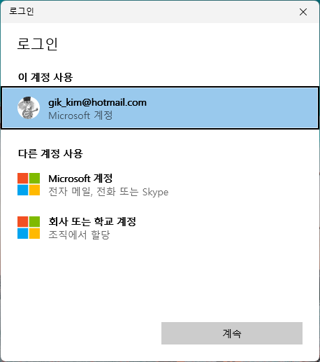

= Windows 11에 Azure CLI 설치

이 문서에서는 Microsoft Windows에 Azure CLI(Command Line Interface)를 설치하는 방법을 설명합니다. 

== 사전 환경 확인

Windows 운영체제에서 Windows 패키지 관리자, Windows 터미널 등을 사용하기 위해서는 Windows 11 22H2 이상의 버전이 설치되어 있어야 합니다. Windows의 현재 버전은 아래 명령으로 확인할 수 있습니다.

[source, powershell]
----
> winver
----

image:./images/image01.png[width=450]

== Windows 패키지 관리자를 사용하여 설치

Windows용 패키지 관리자인 WinGet을 사용하여 Azure CLI를 설치할 수 있습니다. 기본적으로 winget은 64비트 운영체제에 64비트 CLI를 설치합니다. 아래 절차에 따릅니다.

1. Terminal 또는 명령 프롬프트를 실행합니다.
2. 아래 명령을 실행하여 Azure CLI의 설치 여부를 확인합니다.
+
----
winget list | findstr AzureCLI
----
+
3. 설치되어 있지 않다면(결과가 표시되지 않으면) 아래 명령을 실행하여 Windows 패키지 관리자에서 Azure CLI를 검색합니다.
+
----
winget search AzureCLI
----
4. 검색 결과는 아래와 유사할 것입니다.
+
----
이름                장치 ID            버전   원본
-----------------------------------------------------
Microsoft Azure CLI Microsoft.AzureCLI 2.77.0 winget
----
+
5. 아래 명령을 실행하여 Azure CLI를 설치합니다.
+
----
winget install --id Microsoft.AzureCLI
----
[cols="1a"]
+
|===
| **참고** 아래와 같이 --version 옵션을 사용하여 설치를 원하는 버전을 지정할 수 있습니다. 
----
winget install --exact --id Microsoft.AzureCLI --version 2.67.0
----
`--exact` 옵션은 패키지가 설치되어 있는지 여부를 확인합니다.
|===
+
6. 설치가 완료되면, 터미널(또는 명령 프롬프트)를 종료합니다.

== msi를 사용해서 실행

Windows 패키지 관리자를 사용하기 어려운 환경인 경우, msi를 다운로드 하여 설치할 수 있습니다.

1. 아래 링크를 클릭하여 사용중인 컴퓨터의 아키텍처에 맞는 msi 를 다운로드 합니다.
+
https://aka.ms/installazurecliwindows[32bit Azure CLI 다운로드] +
https://aka.ms/installazurecliwindowsx64[64bit Azure CLI 다운로드]
+
2. 다운로드 한 msi를 더블클릭하여 설치를 시작합니다.
3. 설치가 시작되면, **I accept the terms in the License Agreement** 옵션을 체크하고 **Install** 버튼을 클릭합니다.
+

+
4. 설치가 진행됩니다.
+

+
5. 설치가 완료됩니다.
+

=== 설치 확인

1. 터미널(또는 명령 프롬프트)를 시작합니다.
2. 아래 명령을 실행하여 설치된 Azure CLI 버전을 확인합니다.
+
----
az version
----
+
3. 결과는 아래와 유사할 것입니다.
+
----
{
  "azure-cli": "2.77.0",
  "azure-cli-core": "2.77.0",
  "azure-cli-telemetry": "1.1.0",
  "extensions": {}
}
----
+
4. 아래 명령을 실행하여 Azure에 CLI를 통해 로그인을 시도합니다.
+
----
az login
----
+
5. 로그인 창에서, 로그인 할 계정을 선택하고 지정된 방법을 사용해 로그인합니다.
+

+
6. 로그인에 성공하면, 번호를 입력하여 구독(subscription)을 선택합니다.
+
----
Select the account you want to log in with. For more information on login with Azure CLI, see https://go.microsoft.com/fwlink/?linkid=2271136

Retrieving tenants and subscriptions for the selection...

[Tenant and subscription selection]

No     Subscription name    Subscription ID                       Tenant
-----  -------------------  ------------------------------------  -------------
[1] *  Test subscription    079530c9-e0c4-40da-9c91-827e31795fba  기본 디렉터리

The default is marked with an *; the default tenant is '기본 디렉터리' and subscription is 'Test subscription' (079530c9-e0c4-40da-9c91-827e31795fba).

Select a subscription and tenant (Type a number or Enter for no changes):
----
+
7. 아래 명령을 실행하여 구독에 생성되어 있는 리소스 그룹의 목록을 확인합니다.
+
----
az group list
----
+
8. 아래 명령을 실행하여 로그아웃 합니다.
+
----
az logout
----