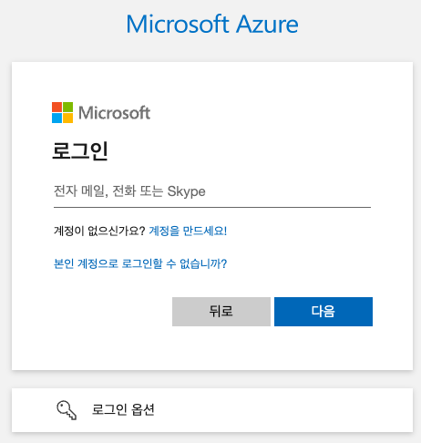

= macOS에 Azure CLI 설치

이 문서에서는 macOS에 Azure CLI(Command Line Interface)를 설치하는 방법을 설명합니다. 

== 사전 환경 확인

macOS에서 Azure CLI를 설치하기 위해서는 homebrew가 필요합니다. howebrew를 사용할 수 없는 경우 Linux에 대한 수동 설치 지침을 사용할 수 있으나, 이 프로세스는 공식적으로 macOS와 호환되도록 유지 관리되지 않습니다. Azure CLI 설치에는 homebrew를 사용하는 것을 권장합니다.

1. 터미널을 실행합니다.
2. 터미널에서 아래 명령을 실행하여 macOS 패키지 관리자인 homebrew가 설치되어 있는지 확인합니다.
+
----
brew -v
----
+
3. homebrew가 설치되어 있지 않으면 아래 명령을 실행하여 homebrew를 설치합니다.
+
----
% /bin/bash -c "$(curl -fsSL https://raw.githubusercontent.com/Homebrew/install/HEAD/install.sh)"
----
+
> **참고** 위 명령이 동작하지 않으면 https://brew.sh/index_ko 에 방문하여 설치 스크립트를 얻어 실행합니다.
+
4. 아래 명령을 실행하여 homebrew를 업데이트 합니다.
+
----
% brew update
----

== Homebrew를 사용하여 Azure CLI 설치

여기에서는 Homebrew를 사용하여 Azure CLI를 설치합니다. 아래 절차에 따릅니다.

1. 터미널을 실행합니다.
2. 아래 명령을 실행하여 homebrew를 업데이트 합니다.
+
----
brew update
----
+
3. 아래 명령을 실행하여 Azure CLI를 검색합니다.
+
----
brew search azure-cli
----
+
4. 결과는 아래와 유사할 것입니다.
+
----
==> Formulae
azure-cli                                                                   vue-cli

If you meant "azure-cli" specifically:
It was migrated from homebrew/cask to homebrew/core.
----
+
5. 아래 명령을 실행하여 Azure CLI를 설치합니다.
+
----
brew install azure-cli
----
+
6. 설치가 완료되면 터미널을 종료합니다.

=== 설치 확인

1. 터미널를 시작합니다.
2. 아래 명령을 실행하여 설치된 Azure CLI 버전을 확인합니다.
+
----
az version
----
+
3. 결과는 아래와 유사할 것입니다.
+
----
{
  "azure-cli": "2.77.0",
  "azure-cli-core": "2.77.0",
  "azure-cli-telemetry": "1.1.0",
  "extensions": {}
}
----
+
4. 아래 명령을 실행하여 Azure에 CLI를 통해 로그인을 시도합니다.
+
----
az login
----
+
5. 웹 브라우저에서 로그인 창이 열리면, 계정을 입력하고 로그인을 완료합니다.
+

+
6. 로그인에 성공하면, 번호를 입력하여 구독(subscription)을 선택합니다.
+
----
Select the account you want to log in with. For more information on login with Azure CLI, see https://go.microsoft.com/fwlink/?linkid=2271136

Retrieving tenants and subscriptions for the selection...

[Tenant and subscription selection]

No     Subscription name    Subscription ID                       Tenant
-----  -------------------  ------------------------------------  -------------
[1] *  Test subscription    079530c9-e0c4-40da-9c91-827e31795fba  기본 디렉터리

The default is marked with an *; the default tenant is '기본 디렉터리' and subscription is 'Test subscription' (079530c9-e0c4-40da-9c91-827e31795fba).

Select a subscription and tenant (Type a number or Enter for no changes):
----
+
7. 아래 명령을 실행하여 구독에 생성되어 있는 리소스 그룹의 목록을 확인합니다.
+
----
az group list
----
+
8. 아래 명령을 실행하여 로그아웃 합니다.
+
----
az logout
----