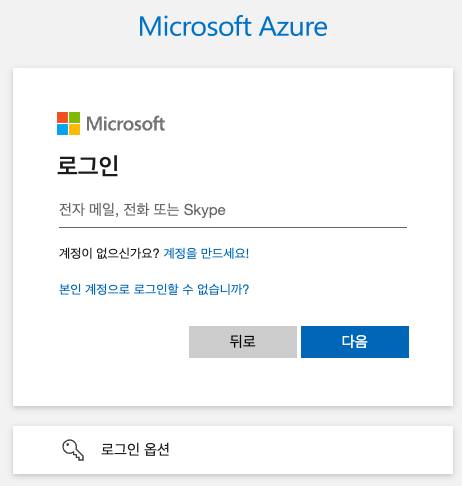

= Linux에 Azure CLI 설치
:toc:

이 문서에서는 Linux(Ubuntu 및 Rocky Linux 등)에 Azure CLI(Command Line Interface)를 설치하는 방법을 설명합니다. 

== Microsoft에서 제공하는 스크립트 사용

Linux에서 Azure CLI를 설치하는 가장 쉬운 방법은 Microsoft의 Azure CLI 팀에서 유지 관리하는 스크립트를 사용하는 것입니다. 이 스크립트는 모든 설치 명령을 한 단계로 실행합니다. 설치 스크립트를 사용하기 위해서는 아래와 같은 소프트웨어가 필요합니다.

* Python 3.8.x, 3.9.x, 3.10.x - 자세한 내용은 지원 수명 주기 - Python 종속성을 참조 하세요.
* libffi
* OpenSSL 1.0.2

=== Debain 계열 Linux(Ubuntu 등)에서 스크립트를 사용한 Azure CLI 설치

아래와 같은 절차로 Microsoft에서 제공하는 스크립트를 사용하여 설치할 수 있습니다.

1. 터미널을 실행합니다.
2. 아래 명령을 실행하여 Azure CLI를 설치합니다. 아래 명령은 curl을 통해 설치 스크립트를 다운로드 하고 스크립트를 bash에 파이프하여 설치를 실행합니다.
+
----
curl -sL https://aka.ms/InstallAzureCLIDeb | sudo bash
----
+
3. 설치가 완료되면, 아래 명령을 실행하여 설치된 Azure CLI의 버전을 확인합니다.
+
----
az version
----
+
4. 결과는 아래와 유사할 것입니다.
+
----
{
  "azure-cli": "2.77.0",
  "azure-cli-core": "2.77.0",
  "azure-cli-telemetry": "1.1.0",
  "extensions": {}
}
----

== RHEL 계열 Linux(RHEL, CentOS, Rocky Linux 등)에서 설치

RHEL 계열의 Linux에서는 현재(2025년 9월) 전용 설치 스크립트가 제공되지 않습니다. 아래 절차로 설치할 수 있습니다.

1. 터미널을 실행합니다.
2. 아래 명령을 실행하여 Microsoft 리포지토리를 가져옵니다.
+
RHEL 10 및 CentOS Stream 10의 경우 아래 명령을 실행합니다.
+
----
sudo rpm --import https://packages.microsoft.com/keys/microsoft-2025.asc
----
RHEL 10, CentOS Stream 10의 하위 버전인 경우(Rocky Linux 9도 해당) 아래 명령을 실행합니다.
+
----
sudo rpm --import https://packages.microsoft.com/keys/microsoft.asc
----
+
3. 아래 명령을 실행하여 packages-microsoft-com-prod 리포지토리를 추가합니다.
+
RHEL 10의 경우 아래 명령을 실행합니다.
+
----
sudo dnf install -y https://packages.microsoft.com/config/rhel/10/packages-microsoft-prod.rpm
----
+
CentOS Stream 10의 경우 아래 명령을 실행합니다.
+
----
sudo dnf install -y https://packages.microsoft.com/config/centos/10/packages-microsoft-prod.rpm
----
+
RHEL 9, CentOS Stream 9, Rocky Linux 9의 경우 아래 명령을 실행합니다.
+
----
sudo dnf install -y https://packages.microsoft.com/config/rhel/9.0/packages-microsoft-prod.rpm
----
+
RHEL 8의 경우 아래 명령을 실행합니다.
+
----
sudo dnf install -y https://packages.microsoft.com/config/rhel/8/packages-microsoft-prod.rpm
----
+
RHEL 7의 경우 아래 명령을 실행합니다.
+
----
echo -e "[azure-cli]
name=Azure CLI
baseurl=https://packages.microsoft.com/yumrepos/azure-cli
enabled=1
gpgcheck=1
gpgkey=https://packages.microsoft.com/keys/microsoft.asc" | sudo tee /etc/yum.repos.d/azure-cli.repo
----
+
4. 아래 명령을 실행하여 Azure CLI를 설치합니다.
+
----
sudo dnf install azure-cli
----
5. 설치가 완료되면, 터미널을 닫습니다.

== 설치 확인

1. 터미널을 시작합니다.
2. 아래 명령을 실행하여 설치된 Azure CLI 버전을 확인합니다.
+
----
az version
----
+
3. 결과는 아래와 유사할 것입니다.
+
----
{
  "azure-cli": "2.77.0",
  "azure-cli-core": "2.77.0",
  "azure-cli-telemetry": "1.1.0",
  "extensions": {}
}
----
+
4. 아래 명령을 실행하여 Azure에 CLI를 통해 로그인을 시도합니다.
+
----
az login
----
+
5. 웹 브라우저에서 로그인 창이 열리면, 계정을 입력하고 로그인을 완료합니다.
+

+
6. 로그인에 성공하면, 번호를 입력하여 구독(subscription)을 선택합니다.
+
----
Select the account you want to log in with. For more information on login with Azure CLI, see https://go.microsoft.com/fwlink/?linkid=2271136

Retrieving tenants and subscriptions for the selection...

[Tenant and subscription selection]

No     Subscription name    Subscription ID                       Tenant
-----  -------------------  ------------------------------------  -------------
[1] *  Test subscription    079530c9-e0c4-40da-9c91-827e31795fba  기본 디렉터리

The default is marked with an *; the default tenant is '기본 디렉터리' and subscription is 'Test subscription' (079530c9-e0c4-40da-9c91-827e31795fba).

Select a subscription and tenant (Type a number or Enter for no changes):
----
+
7. 아래 명령을 실행하여 구독에 생성되어 있는 리소스 그룹의 목록을 확인합니다.
+
----
az group list
----
+
8. 아래 명령을 실행하여 로그아웃 합니다.
+
----
az logout
----