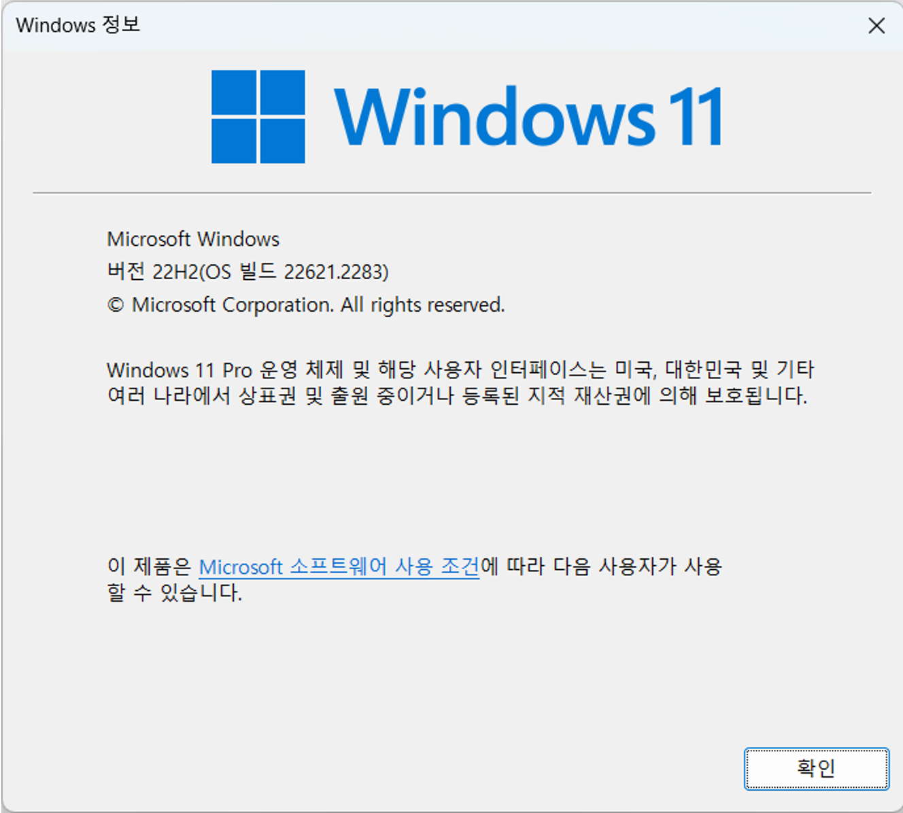

= Windows 11에서 Visual Studio Code 설치

이 연습에서는 Windows 11에 Visual Studio Code를 설치합니다.

== 사전 환경 확인

Windows 운영체제에서 Windows 패키지 관리자, Windows 터미널 등을 사용하기 위해서는 Windows 11 22H2 이상의 버전이 설치되어 있어야 합니다. Windows의 현재 버전은 아래 명령으로 확인할 수 있습니다.

----
winver
----

== Visual Studio Code 설치

여기에서는 Visual Studio Code를 설치합니다. 아래 절차에 따릅니다.

1. Windows Terminal을 엽니다.
2. 아래 명령을 실행하여 Visual Studio Code를 검색합니다.
+
----
\> winget search visualstudiocode
이름                                      장치 ID                                 버전    원본
-------------------------------------------------------------------------------------------------
Microsoft Visual Studio Code              Microsoft.VisualStudioCode              1.105.1 winget
Microsoft Visual Studio Code CLI          Microsoft.VisualStudioCode.CLI          1.105.1 winget
Microsoft Visual Studio Code Insiders     Microsoft.VisualStudioCode.Insiders     1.106.0 winget
Microsoft Visual Studio Code Insiders CLI Microsoft.VisualStudioCode.Insiders.CLI 1.106.0 winget
----
+
3. 아래 명령을 실행하여 Visual Studio Code를 설치합니다.
+
----
> winget install -e Microsoft.VisualStudioCode

찾음 Microsoft Visual Studio Code [Microsoft.VisualStudioCode] 버전 1.82.2
이 응용 프로그램의 라이선스는 그 소유자가 사용자에게 부여했습니다.
Microsoft는 타사 패키지에 대한 책임을 지지 않고 라이선스를 부여하지도 않습니다.
다운로드 중 https://az764295.vo.msecnd.net/stable/abd2f3db4bdb28f9e95536dfa84d8479f1eb312d/VSCodeUserSetup-x64-1.82.2.exe
  ██████████████████████████████  89.9 MB / 89.9 MB
설치 관리자 해시를 확인했습니다.
패키지 설치를 시작하는 중...
설치 성공
----